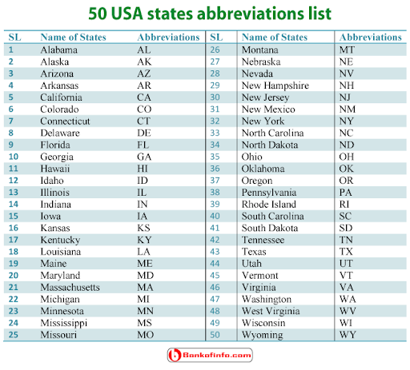

```{r warning=FALSE,echo=FALSE,message=FALSE}

library(tidyverse)
library(tidymodels)
library(ggtext)
library(knitr)
library(kableExtra)
library(ggplot2)
library(lubridate)
library(dplyr)
library(data.table)
library(ggrepel)
library(rworldmap)
library(usmap)
library(ggalt)
library(DataExplorer)
library(DataExplorer)
set.seed(1234)
options(dplyr.print_min = 10, dplyr.print_max = 6)
```
<style>
body {
text-align: justify}
</style>

## Introduction about the dataset

A05 Assignment EDA2 post is created for analyzing the weather data of USA. The weather data set is obtained from NOAA Daily Global Historical Climatology Network. The data analysis in this page is supported by various R platform based packages such as Tidyverse, GGPlot, GGalt, USmap, and Shiny Application. Most significantly, a reactive visualization is also included in this page with the help of Shiny app. This dataset contains various parameters in 1395 rows and 15 columns such as Station, State, latitude, longitude, elevation, date, Minimum Temperature, Maximum Temperature, Average Temperature, Average daily wind speed , Direction of fastest 5-second wind, Fastest 5-second wind speed, Snowfall, Snow Depth and Precipitation. 


## Blank and Reference USA Map

  The United States of America has 52 states, out of which 42 states are considered in the dataset "weather_dataset". In this plot,USA map is surrounded by blue color as border and Alaska is shown at the bottom of the map. The states are displayed in short terms as labels for easy identification.
  
```{r warning=FALSE,echo=FALSE,message=FALSE, include=FALSE}

plot_usmap(regions = "states",labels=TRUE) + 
  labs(title = "USA States",
       subtitle = "This is a blank map of the counties of the United States.") + 
  theme(panel.background = element_rect(color = "black", fill = "lightblue"))
```

```{r out.width="98%", echo=FALSE}

```
## Initial Analysis Questions

i)    How often the state Arizona records the maximum temperature higher than the 80 degree Fahrenheit?

ii)  Which states record high and low average temperatures? 

iii)  How the precipitation levels are varied among the states?

iv)   Which state records the maximum value of temperature?

v)    Which states record high and low value of fastest 5-second wind speed (WSF5)?

vi)   What is the average range of highest average daily wind speed among the states?

vii)  How many states recorded fastest 5-second wind speed higher than 60 tenths of meters per second?

viii) What is the angle of inclination of linear prediction line for the linear model between average Temperature and elevation level of the location based on the geo-coordinates?

ix)   Are the residual values of previous linear model are high or low in the current linear dataset?

```{r warning=FALSE,echo=FALSE,message=FALSE}
wd <- read_csv("weather_dataset.csv", na = c("n/a", "", "NA"))
DataExplorer::create_report(wd)

```

## Discoveries & Insights

## 1. Maximum Temperature analysis

Weather application depicts the maximum temperature among the 42 states of USA for the range of dates from 1st January 2017 to 21st September 2017. The App user can select the range of date and the state to view the visualization. The Maximum temperature from various meteorological stations are plotted in Y axis with respect to the selected range of dates in X - axis for the selected state. The maximum temperature is plotted in Magenta Color for the temperatures higher than or equal to 80 deg Fahrenheit, 
whereas it is plotted in Green color for the temperatures lesser than 80.Almost, 35% of the plots are magenta in color, so that the state Arizona strikes the temperature higher than 80 degree Fahrenheit once in a 3 days approximately.  

<iframe src= https://raghulmohankumar.shinyapps.io/US_Weather/ height="800" width="100%" frameborder="no" onload="resizeIframe(this)"></iframe> 


## 2. Average Temparature

In this Section, the parameter TAVG (Average Temperature) is considered for all the states in the states in the dataset.In this plot, the average temperature recorded from the various cities  at specific stations on a given day, are plotted over the US map. The temperature plots are sized according to the value of the temperature in Fahrenheit. From the plot, it is identified that the Northern states are recorded with high average temperatures, rather than the southern states of USA. For example, the states such as Washington, Minnesota, New York and Michigan are recorded with high average temperatures, whereas the states such as Arizona, North Carolina, New Mexico and Virginia are recorded with low average temperatures.

```{r warning=FALSE,echo=FALSE,message=FALSE}
data_1 <- data.frame(lon=wd$longitude,lat=wd$latitude,pop_1=wd$TAVG)
d1_transformed <- usmap_transform(data_1)
plot_usmap(regions = "states",labels=TRUE) +
  geom_point(data = d1_transformed, aes(x = lon.1, y = lat.1, size="TAVG"),
             color = "red", alpha = 0.15) +
  labs(title = "Average Temperature",
       subtitle = "Source: US Meteorological Department from 01/01/2017 to 31/05/2017") +
  theme(panel.background = element_rect(color = "black", fill = "lightblue"),legend.position = "right")

```

## 3. Precipitation levels in USA

In this Section, the parameter PRCP (Precipitation level) is considered for all the states in the states in the dataset.In this plot, the Precipitation level recorded from the various cities are plotted over the US map rendered through plot_usmap() function. The Precipitation level plots are sized according to the value of the precipitation in in tenths of millimeters of water equivalent. In this work "PRCP" means the total liquid water equivalent of presumably all precipitation. If it is not all precipitation, it is at least the combination of rain and liquid water equivalent of snow.From the plot, it is identified that the Northern states are recorded with high precipitation levels, rather than the southern states of USA.For example, the states such as Washington, Minnesota, New York and Michigan are recorded with high precipitation levels, whereas the states such as Arizona, North Carolina, New Mexico and Virginia are recorded with low precipitation levels.


```{r warning=FALSE,echo=FALSE,message=FALSE}
data_2 <- data.frame(lon=wd$longitude,lat=wd$latitude,pop_2=wd$PRCP)
d2_transformed <- usmap_transform(data_2)
plot_usmap() +
  geom_point(data = d2_transformed, aes(x = lon.1, y = lat.1, size="PRCP"),
             color = "Blue", alpha = 0.1) +
  labs(title = "Precipitation in USA",
       subtitle = "Source: US Meteorological Department from 01/01/2017 to 31/05/2017") +
  theme(panel.background = element_rect(color = "black", fill = "lightblue"),legend.position = "right")

```


## 4. Maximum temperature of states of USA

```{r warning=FALSE,echo=FALSE,message=FALSE}
require(data.table)
dt <- data.table(wd)
dtavg<-data.frame(dt[ , max(TMAX), by = state])
ggplot(dtavg, aes(x=state, y=V1)) + geom_bar(stat = "identity",color="yellow", fill=rgb(0.1,0.4,0.5,0.7))+ scale_x_discrete(guide = guide_axis(n.dodge=3)) 
```
In this Section, the highest value of maximum temperature is plotted against the states with the help of bar chart. The highest value of maximum temperature is recorded in the state of Nebraska with the value of 55.94 degree Celsius.  The lowest value of maximum temperature is recorded in the state of Oklahoma with the value of 19 degree Celsius. However, the most of states have recorded with the maximum temperatures between 35 to 45 degree Celsius. Also, the states such as Michigan, North Carolina, Nevada and Ohio have recorded the highest temperatures above 50 degree Celsius.

```{r out.width="98%", echo=FALSE}

```

## 5. Fastest 5-second wind speed (WSF5)

In this Section, the parameter WSF5 (Fastest 5-second wind speed ) is considered for all the states in the states in the dataset.In this plot, the Fastest 5-second wind speed  recorded from the various cities are plotted over the US map. The Fastest 5-second wind speed plots are sized according to the value of the Fastest 5-second wind speed in tenths of meters per second. From the plot, it is identified that the Northern states are recorded with high Fastest 5-second wind speed in meters per second, rather than the southern states of USA. For example, the states such as Washington, Minnesota, New York and Michigan are recorded with high Fastest 5-second wind speed, whereas the states such as Arizona, North Carolina, New Mexico and Virginia are recorded with low Fastest 5-second wind speed.

```{r warning=FALSE,echo=FALSE,message=FALSE}

data_3 <- data.frame(lon=wd$longitude,lat=wd$latitude,pop_3=wd$WSF5)
d3_transformed <- usmap_transform(data_3)
plot_usmap() +
  geom_point(data = d3_transformed, aes(x = lon.1, y = lat.1, size="WSF5"),
             color = "green", alpha = 0.15) +
  labs(title = " Fastest 5-second wind speed (tenths of meters per second) in USA",
       subtitle = "Source: US Meteorological Department from 01/01/2017 to 31/05/2017") +
  theme(panel.background = element_rect(color = "black", fill = "lightblue"),legend.position = "right")

```

## 6. Average daily wind speed (AWND)

In this Section, the parameter AWND (Average daily wind speed) is considered for all the states in the states in the dataset. In this plot, the Average daily wind speed  recorded from the various cities are plotted over the scattered plot. The Average daily wind speed plots are sized according to the value of the Average daily wind speed in tenths of meters per second. From the plot, it is identified that the Alaska state is recorded with the highest average daily wind speed 33 tenths of meters per second.On the other hand, the Tennessee state is recorded with the lowest average daily wind speed 7.5 tenths of meters per second. Most of the states have been recorded with the highest average daily wind speed in the range of 17 to 25 tenths of meters per second.


```{r warning=FALSE,echo=FALSE,message=FALSE}
require(data.table)
dt_1 <- data.table(wd)
dtawnd<-data.frame(dt_1[ , max(AWND), by = state])
ggplot(dtawnd, aes(x=state, y=V1)) + geom_point(stat = "identity",color="red", fill=rgb(0.1,0.4,0.5,0.7)) + scale_x_discrete(guide = guide_axis(n.dodge=3))+
  labs(subtitle=" Average daily wind speed", 
       y=" tenths of meters per second", 
       x="States", 
       title="Scatterplot", 
       caption="NOAA Global Historical Climatology Network Daily") + scale_x_discrete(guide = guide_axis(n.dodge=3))
```

## 7. States with High Fastest Winds

In this Section, the parameter WSF5 (Fastest 5-second wind speed ) is considered for all the states in the states in the dataset. In this plot, the Fastest 5-second wind speed  recorded from the various cities are plotted over the scattered plot. The Fastest 5-second wind speed plots are sized according to the value of the Fastest 5-second wind speed in tenths of meters per second. From the plot, it is identified that the Indiana state is recorded with the highest Fastest 5-second wind speed 71 tenths of meters per second.On the other hand, the Oklahoma state is recorded with the lowest Fastest 5-second wind speed 21 tenths of meters per second. Most of the states have been recorded with the highest Fastest 5-second wind speed in the range of 35 to 55 tenths of meters per second.The scattered plots are sized according to the value of the wind speed in tenths of meters per second. From the plot, it is identified that the colors of the plot is differentiated based on the state and the Fastest 5-second wind speed higher than 60 tenths of meters per second are encircled. Therefore, it is clearly observable that 6 states have recorded fastest 5-second wind speed higher than 60 tenths of meters per second.

```{r warning=FALSE,echo=FALSE,message=FALSE}
require(data.table)
dt_3 <- data.table(wd)
dtwsf5<-data.frame(dt_3[ , max(WSF5), by = state])
circle.df <- dtwsf5 %>% filter(V1 >=60)
ggplot(dtwsf5, aes(x=state, y=V1)) + geom_point(aes(col=state, size=V1)) +  
  geom_smooth(method="loess", se=F) + 
   geom_encircle(aes(x=state, y=V1), 
                data=circle.df, 
                color="red", 
                size=1, 
                expand=0.01) +   # encircle
  labs(subtitle="Fastest 5-second wind speed", 
       y=" tenths of meters per second", 
       x="States", 
       title="Scatterplot + Encircle", 
       caption="NOAA Global Historical Climatology Network Daily") + scale_x_discrete(guide = guide_axis(n.dodge=3))
```

## 8. Goal: Predict Average Temperature from Elevation (Linear Model)

In this Section, the parameter TAVG (Average Temperature) is predicted from the parameter Elevation as they both are proportional to each other. This work is done by the linear modelling method on the dataset along with smoothening work. It is clear from the plot that the purple line at the inclination shows the linear prediction line for the Average Temperature according the elevation level of the location based on the geo-coordinates.However, it is possible to identify some scarce amount of plots away from the purple line.

```{r AWND-WSF5-plot, echo=FALSE, warning=FALSE}
ggplot(data = wd, aes(x = AWND, y = WSF5)) +
  geom_point() +
  geom_smooth(method = "lm", se = FALSE, color = "#8E2C90") + 
  labs(
    title = "Average daily wind speed vs. Fastest 5-second wind speed",
    subtitle = "tenths of meters per second",
    x = "Average daily wind speed (tenths of meters per second)",
    y = "Fastest 5-second wind speed (tenths of meters per second)"
  )
```

# Step 1: Specify model

```{r warning=FALSE,echo=FALSE,message=FALSE, include = FALSE}
linear_reg()
```
# Step 2: Set model fitting *engine*

```{r warning=FALSE,echo=FALSE,message=FALSE, include = FALSE}
linear_reg() %>%
  set_engine("lm") # lm: linear model
```

# Step 3: Fit model & estimate parameters

```{r fit-model, warning=FALSE,echo=FALSE,message=FALSE,include = FALSE}
linear_reg() %>%
  set_engine("lm") %>%
  fit(WSF5 ~ AWND, data = wd)
```

# A closer look at model output

```{r ref.label="fit-model", warning=FALSE,echo=FALSE,message=FALSE, include = FALSE}
```

# A tidy look at model output

```{r warning=FALSE,echo=FALSE,message=FALSE,include = FALSE}
linear_reg() %>%
  set_engine("lm") %>%
  fit(WSF5 ~ AWND, data = wd) %>%
  tidy()
```

# 9. Visualizing residuals

In this Section, the residuals are visualized with the attempt of fitting the parameter WSF5 (Fastest 5-second wind speed) and AWND (Average daily wind speed). This work is done by the linear regression method and setting engine operation. In specific, the dataset wd is used as main source of data, in which the parameters WSF5 (Fastest 5-second wind speed) and AWND (Average daily wind speed) are present. Then, the dataset WSF5_AWND_fit_aug is inherited from the WSF5_AWND_fit dataset for plotting the least square lines amn residual values along it, so that it is inferred that the residual values are high in this linear dataset. The final plot depicts the linear model data + least squares line + residuals. Therefore, this dataset fits well in the linear model and linear regression is executed in this plot.


```{r vis-res-1, warning=FALSE,echo=FALSE,message=FALSE, out.width="70%"}
WSF5_AWND_fit <- linear_reg() %>%
  set_engine("lm") %>%
  fit(WSF5 ~ AWND, data = wd)
WSF5_AWND_fit_tidy <- tidy(WSF5_AWND_fit$fit) 
WSF5_AWND_fit_aug  <- augment(WSF5_AWND_fit$fit) %>%
  mutate(res_cat = ifelse(.resid > 0, TRUE, FALSE))
p <- ggplot(data = WSF5_AWND_fit_aug, 
            aes(x = AWND, y = WSF5)) +
  geom_point(alpha = 0.2) + 
  labs(
    title = "Average daily wind speed vs. Fastest 5-second wind speed",
    subtitle = "tenths of meters per second",
   x = "Average daily wind speed (tenths of meters per second)",
    y = "Fastest 5-second wind speed (tenths of meters per second)"
    ) +
  coord_cartesian(xlim = c(0, 40), ylim = c(0, 75)) +
  theme(plot.subtitle = element_text(colour = "#E48957", face = "bold", size = rel(1.5)))
p <- p + 
  geom_smooth(method = "lm", color = "#8E2C90", se = FALSE) +
  geom_point(mapping = aes(y = .fitted), color = "#E48957") +
  labs(subtitle = "Data + least squares line")
p + 
  geom_segment(mapping = aes(xend = AWND, yend = .fitted), color = "#E48957", alpha = 0.4) +
  labs(subtitle = "Data + least squares line + residuals")
```

# Summary

The conclusion? The weather of the states of USA is so diversified so that all the weather parameters are varied among the states in a wide range. Therefore, the weather monitoring is performed with the help of 1589 stations throughout these states to capture the recordings from the diversified atmosphere. Some of the data entries are empty in the initial dataset, which should be avoided through proper and continuous monitoring of weather. Overall, the USA has good weather for the mankind despite the high temperature and high winds in certain states. Furthermore, the weather of central region of USA is favorable for the human driven regular activities such as exploration, hiking, sightseeing and bush walking.

