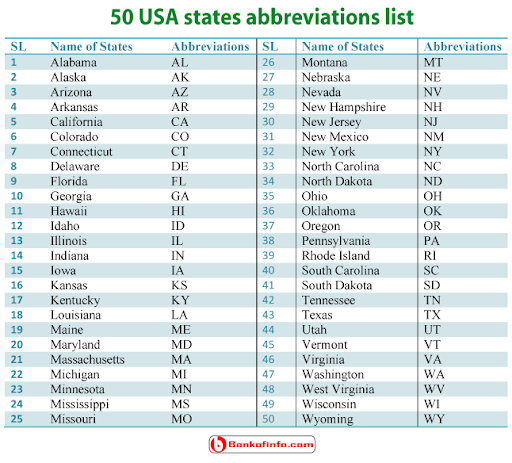

```{r warning=FALSE,echo=FALSE,message=FALSE}

library(tidyverse)
library(tidymodels)
library(ggtext)
library(knitr)
library(kableExtra)
library(ggplot2)
library(lubridate)
library(dplyr)
library(data.table)
library(ggrepel)
library(rworldmap)
library(usmap)
library(ggalt)
library(readxl)
set.seed(1234)
options(dplyr.print_min = 10, dplyr.print_max = 6)
```
<style>
body {
text-align: justify}
</style>

## Introduction
A05 Assignment EDA2 post is created through the R studio for analyzing the weather data of USA. The weather data set is obtained from NOAA Daily Global Historical Climatology Network. The data analysis in this page is supported by various R platform based packages such as Tidyverse, GGPlot, GGalt, USmap, and Shiny Application. Most significantly, a reactive visualization is also included in this page with the help of Shiny app. 

## Import Dataset : US_Weather

```{r warning=FALSE,echo=FALSE,message=FALSE}

wd <- read_csv("weather_dataset.csv", na = c("n/a", "", "NA"))
```

```{r out.width="98%", echo=FALSE}

```

## 1. Maximum Temperature analysis through Shiny Application

Weather application depicts the maximum temperature among the 42 states of USA for the range of dates from 1st January 2017 to 21st September 2017. The App user can select the range of date and the state to view the visualization. The Maximum temperature from various meteorological stations are plotted in Y axis with respect to the selected range of dates in X - axis for the selected state. The Air quality Index is plotted in Magenta Color for the temperatures higher than or equal to 80 deg Fahrenheit, 
whereas it is plotted in Green color for the temperatures lesser than 80. Most Significantly, user can download the visualization plot in the formats such as PDF, PNG and JPEG. Furthermore, the dataset is available to download in two modes,  one is from the application and another is from the web link.

<iframe src= https://raghulmohankumar.shinyapps.io/US_Weather/ height="800" width="100%" frameborder="no" onload="resizeIframe(this)"></iframe> 

## Blank and Reference USA Map

  The United States of America has 52 states, out of which 42 states are considered in the dataset "weather_dataset". For depicting the plots over the USA map, plot_us() function is used as it need not any API support unlike google_map() function. In this plot,USA map is surrounded by blue colour as border and Alaska is shown at the bottom of the map. The states are displayed in short terms as labels for easy identification.
  
```{r warning=FALSE,echo=FALSE,message=FALSE}

plot_usmap(regions = "states",labels=TRUE) + 
  labs(title = "USA States",
       subtitle = "This is a blank map of the counties of the United States.") + 
  theme(panel.background = element_rect(color = "black", fill = "lightblue"))
```

## 2. Average Temparature

In this Section, the parameter TAVG (Average Temparature) is considered for all the states in the states in the dataset.In this plot, the average temperature recorded from the various cities  at specific stations on a given day, are plotted over the US map rendered through plot_usmap() function. The temperature plots are sized according to the value of the temperature in Fahrenheit. From the plot, it is identified that the Northern states are recorded with high average temperatures, rather than the southern states of USA.

```{r warning=FALSE,echo=FALSE,message=FALSE}
data_1 <- data.frame(lon=wd$longitude,lat=wd$latitude,pop_1=wd$TAVG)
d1_transformed <- usmap_transform(data_1)
plot_usmap() +
  geom_point(data = d1_transformed, aes(x = lon.1, y = lat.1, size="TAVG"),
             color = "red", alpha = 0.15) +
  labs(title = "Average Temperature",
       subtitle = "Source: US Meteorological Department from 01/01/2017 to 31/05/2017") +
  theme(panel.background = element_rect(color = "black", fill = "lightblue"),legend.position = "right")

```

## 3. Precipitation levels in USA

In this Section, the parameter PRCP (Precipitation level) is considered for all the states in the states in the dataset.In this plot, the Precipitation level recorded from the various cities are plotted over the US map rendered through plot_usmap() function. The Precipitation level plots are sized according to the value of the precipitation in in tenths of millimeters of water equivalent. In this work "PRCP" means the total liquid water equivalent of presumably all precipitation. If it is not all precipitation, it is at least the combination of rain and liquid water equivalent of snow.From the plot, it is identified that the Northern states are recorded with high precipitation levels, rather than the southern states of USA.

```{r warning=FALSE,echo=FALSE,message=FALSE}
data_2 <- data.frame(lon=wd$longitude,lat=wd$latitude,pop_2=wd$PRCP)
d2_transformed <- usmap_transform(data_2)
plot_usmap() +
  geom_point(data = d2_transformed, aes(x = lon.1, y = lat.1, size="PRCP"),
             color = "Blue", alpha = 0.1) +
  labs(title = "Precipitation in USA",
       subtitle = "Source: US Meteorological Department from 01/01/2017 to 31/05/2017") +
  theme(panel.background = element_rect(color = "black", fill = "lightblue"),legend.position = "right")

```


## 4. Maximum Total Average Temperature of states of USA

```{r warning=FALSE,echo=FALSE,message=FALSE}
require(data.table)
dt <- data.table(wd)
dtavg<-data.frame(dt[ , max(TAVG), by = state])
ggplot(dtavg, aes(x=state, y=V1)) + geom_bar(stat = "identity",color="yellow", fill=rgb(0.1,0.4,0.5,0.7))+ scale_x_discrete(guide = guide_axis(n.dodge=3)) 
```

```{r out.width="98%", echo=FALSE}

```

## 5. Fastest 5-second wind speed (WSF5)

In this Section, the parameter WSF5 (Fastest 5-second wind speed ) is considered for all the states in the states in the dataset.In this plot, the Fastest 5-second wind speed  recorded from the various cities are plotted over the US map rendered through plot_usmap() function. The Fastest 5-second wind speed plots are sized according to the value of the Fastest 5-second wind speed in tenths of meters per second. From the plot, it is identified that the Northern states are recorded with high Fastest 5-second wind speed in meters per second, rather than the southern states of USA.

```{r warning=FALSE,echo=FALSE,message=FALSE}

data_3 <- data.frame(lon=wd$longitude,lat=wd$latitude,pop_3=wd$WSF5)
d3_transformed <- usmap_transform(data_3)
plot_usmap() +
  geom_point(data = d3_transformed, aes(x = lon.1, y = lat.1, size="WSF5"),
             color = "green", alpha = 0.15) +
  labs(title = " Fastest 5-second wind speed (tenths of meters per second) in USA",
       subtitle = "Source: US Meteorological Department from 01/01/2017 to 31/05/2017") +
  theme(panel.background = element_rect(color = "black", fill = "lightblue"),legend.position = "right")

```

## 6. Average daily wind speed (AWND)

```{r warning=FALSE,echo=FALSE,message=FALSE}
require(data.table)
dt_1 <- data.table(wd)
dtawnd<-data.frame(dt_1[ , max(AWND), by = state])
ggplot(dtawnd, aes(x=state, y=V1)) + geom_point(stat = "identity",color="red", fill=rgb(0.1,0.4,0.5,0.7)) + scale_x_discrete(guide = guide_axis(n.dodge=3))+
  labs(subtitle=" Average daily wind speed", 
       y=" tenths of meters per second", 
       x="States", 
       title="Scatterplot + Encircle", 
       caption="NOAA Global Historical Climatology Network Daily") + scale_x_discrete(guide = guide_axis(n.dodge=3))
```

## 7. States with High Fastest Winds


In this Section, the parameter TMAX (Maximum Temperature) is considered for all the states in the states in the dataset.In this encircle based scatterplot, "TMAX" means the maximum recorded temperature at a given station on a given day, i.e., the high temperature. These temperature data were archived in tenths of degrees Celsius.This data is plotted over the US map rendered through plot_usmap() function. The maximum Temperature plots are sized according to the value of the temperature in tenths of degrees Celsius. From the plot, it is identified that the colours of the plot is differentiated based on the state and the temperatures higher than 60 degree fahrenheit are encircled using the geom_encircle() function.


```{r warning=FALSE,echo=FALSE,message=FALSE}
require(data.table)
dt_3 <- data.table(wd)
dtwsf5<-data.frame(dt_3[ , max(WSF5), by = state])
circle.df <- dtwsf5 %>% filter(V1 >=60)
ggplot(dtwsf5, aes(x=state, y=V1)) + geom_point(aes(col=state, size=V1)) +  
  geom_smooth(method="loess", se=F) + 
   geom_encircle(aes(x=state, y=V1), 
                data=circle.df, 
                color="red", 
                size=1, 
                expand=0.01) +   # encircle
  labs(subtitle="Fastest 5-second wind speed", 
       y=" tenths of meters per second", 
       x="States", 
       title="Scatterplot + Encircle", 
       caption="NOAA Global Historical Climatology Network Daily") + scale_x_discrete(guide = guide_axis(n.dodge=3))
```

## 8. Goal: Predict Average Temperature from Elevation (Linear Model)

In this Section, the parameter TAVG (Average Temperature) is predicted from the parameter Elevation as they both are proportional to each other. This work is done by the linear modelling method on the dataset with the geom_smooth() function for smoothening purposes. It is clear from the plot that the purple line at the inclination shows the linear prediction line for the Average Temperature according the elevation level of the location based on the geo-coordinates.However, it is possible to identify some scarce amount of plots away from the purple line.

```{r AWND-WSF5-plot, echo=FALSE, warning=FALSE}
ggplot(data = wd, aes(x = AWND, y = WSF5)) +
  geom_point() +
  geom_smooth(method = "lm", se = FALSE, color = "#8E2C90") + 
  labs(
    title = "Average daily wind speed vs. Fastest 5-second wind speed",
    subtitle = "tenths of meters per second",
    x = "Average daily wind speed (tenths of meters per second)",
    y = "Fastest 5-second wind speed (tenths of meters per second)"
  )
```

# Step 1: Specify model

```{r warning=FALSE,echo=FALSE,message=FALSE, include = FALSE}
linear_reg()
```
# Step 2: Set model fitting *engine*

```{r warning=FALSE,echo=FALSE,message=FALSE, include = FALSE}
linear_reg() %>%
  set_engine("lm") # lm: linear model
```

# Step 3: Fit model & estimate parameters

```{r fit-model, warning=FALSE,echo=FALSE,message=FALSE,include = FALSE}
linear_reg() %>%
  set_engine("lm") %>%
  fit(WSF5 ~ AWND, data = wd)
```

# A closer look at model output

```{r ref.label="fit-model", warning=FALSE,echo=FALSE,message=FALSE, include = FALSE}
```

# A tidy look at model output

```{r warning=FALSE,echo=FALSE,message=FALSE,include = FALSE}
linear_reg() %>%
  set_engine("lm") %>%
  fit(WSF5 ~ AWND, data = wd) %>%
  tidy()
```

# 9. Visualizing residuals

In this Section, the residuals are visualised with the attempt of fitting the parameter WSF5 (Fastest 5-second wind speed) and AWND (Average daily wind speed). This work is done by the linear regression function linear_reg() and setting engine function set_engine(). In specific, the dataset wd is used as main source of data. Then, the dataset WSF5_AWND_fit_aug is inherited from the WSF5_AWND_fit dataset through the functions augment() and tidy() functions. The final plot depicts the linear model data + least squares line + residuals. Therefore, this dataset fits well in the linear model and linear regression is executed in this plot.


```{r vis-res-1, warning=FALSE,echo=FALSE,message=FALSE, out.width="70%"}
WSF5_AWND_fit <- linear_reg() %>%
  set_engine("lm") %>%
  fit(WSF5 ~ AWND, data = wd)
WSF5_AWND_fit_tidy <- tidy(WSF5_AWND_fit$fit) 
WSF5_AWND_fit_aug  <- augment(WSF5_AWND_fit$fit) %>%
  mutate(res_cat = ifelse(.resid > 0, TRUE, FALSE))
p <- ggplot(data = WSF5_AWND_fit_aug, 
            aes(x = AWND, y = WSF5)) +
  geom_point(alpha = 0.2) + 
  labs(
    title = "Average daily wind speed vs. Fastest 5-second wind speed",
    subtitle = "tenths of meters per second",
   x = "Average daily wind speed (tenths of meters per second)",
    y = "Fastest 5-second wind speed (tenths of meters per second)"
    ) +
  coord_cartesian(xlim = c(0, 40), ylim = c(0, 75)) +
  theme(plot.subtitle = element_text(colour = "#E48957", face = "bold", size = rel(1.5)))
p <- p + 
  geom_smooth(method = "lm", color = "#8E2C90", se = FALSE) +
  geom_point(mapping = aes(y = .fitted), color = "#E48957") +
  labs(subtitle = "Data + least squares line")
p + 
  geom_segment(mapping = aes(xend = AWND, yend = .fitted), color = "#E48957", alpha = 0.4) +
  labs(subtitle = "Data + least squares line + residuals")
```


