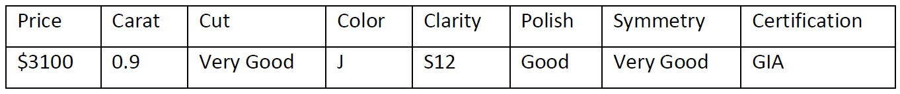

<style>
body {
text-align: justify}
</style>

A professor of machine learning is planning to get married to his long-time girlfriend. He has never shopped for diamonds before. In the mall, he was confronted with a dizzying array of diamond characteristics, configurations, and pricing. His quick search revealed that diamonds are primarily characterized by 4C viz. Color, Cut, Carat Weight and Clarity besides Polish, Symmetry, and certification. He scrapped the web to collect information from three different wholesaler websites to build his pricing model to ensure he does not get cheated while purchasing the diamond ring. This blog builds a Linear Regression Model to predict the price of the diamond ring of his interest.

```{r out.width="98%", echo=FALSE}

```


## Load Packages

```{r warning=FALSE,echo=FALSE,message=FALSE}
library(tidyverse)
library(tidymodels)
library(ggplot2)
library(GGally)
library(dplyr)
library(psych)
library(Hmisc)
library(memisc)
library(pastecs)
library(rstatix)
library(bivariate)
library(ggtext)
library(scorecardModelUtils)
library(scatterplot3d)
library(knitr)
library(readxl)
library(ggdark)
library(kableExtra)
library(gridExtra)
library(MASS)
library(bitops)
library(RCurl)
library(ggcorrplot)
library(corrplot)
set.seed(1234)
options(dplyr.print_min = 10, dplyr.print_max = 6)
```

## Import Dataset : Diamond data

```{r warning=FALSE,echo=FALSE,message=FALSE}

pp <- read_excel("MBA6636_SM21_Professor_Proposes_Data.xlsx", na = c("n/a", "", "NA"))
```

## Summary Statistics

The summary of the dataset is shown below. The summary of metric data has the values such as minimum, first quartile, median, mean, third quartile and maximum. However, the summary of non-metric data has the summary of length, class and mode.

```{r warning=FALSE,echo=FALSE,message=FALSE}
summary(pp)
```

## Univariate Analysis

Univariate analysis of the dataset explores the minimum, maximum, range, sum, mean, median, mode, SE.mean, variance, standard deviation and coefficient variance of the individual characteristics of the diamonds. In addition, this analysis includes the histogram plots for the frequency of data in the dataset and scatter plots of the Price with respect to the characteristics of the diamond such as Carat, Colour, Clarity, Cut, Certification, Polish and Symmetry. In the scatter plot, the colors are configured based on the price value as it is easily noticed that two sets of data are present in the dataset, based on the price. To identify the price range, different colour schemes are used. The low cost data ranges till 0.3 carat and 700 CAD, whereas high cost data ranges between 0.8 and 1.6 carats and 1800 CAD and $3200 CAD.

```{r warning=FALSE,echo=FALSE,message=FALSE}
describe(pp)
stat.desc(pp)
hist.data.frame(pp)

ggplot(pp, aes(x=Carat, y= as.numeric(Price), color = (Price >= 1000))) + geom_point(show.legend = FALSE) + 
  labs(x = 'Carat', y='Price(CAD)') +ggtitle("Scatter Plot Carat vs Price")+  theme_minimal() +
  theme(plot.title = element_text(hjust = 0.5))

ggplot(pp, aes(x=Cut, y= as.numeric(Price), color = (Price >= 1000))) + geom_point(show.legend = FALSE) + 
  labs(x = 'Cut', y='Price(CAD)') +ggtitle("Scatter Plot Cut vs Price")+  theme_minimal() +
  theme(plot.title = element_text(hjust = 0.5))

ggplot(pp, aes(x=Clarity, y= as.numeric(Price), color = (Price >= 1000))) + geom_point(show.legend = FALSE) + 
  labs(x = 'Clarity', y='Price(CAD)') +ggtitle("Scatter Plot Clarity vs Price")+  theme_minimal() +
  theme(plot.title = element_text(hjust = 0.5))

ggplot(pp, aes(x=Colour, y= as.numeric(Price), color = (Price >= 1000))) + geom_point(show.legend = FALSE) + 
  labs(x = 'Colour', y='Price(CAD)') +ggtitle("Scatter Plot Colour vs Price")+  theme_minimal() +
  theme(plot.title = element_text(hjust = 0.5))

ggplot(pp, aes(x=Certification, y= as.numeric(Price), color = (Price >= 1000))) + geom_point(show.legend = FALSE) +   labs(x = 'Certification', y='Price(CAD)') +ggtitle("Scatter Plot Certification vs Price")+  theme_minimal() +
  theme(plot.title = element_text(hjust = 0.5))

ggplot(pp, aes(x=Polish, y= as.numeric(Price), color = (Price >= 1000))) + geom_point(show.legend = FALSE) +   labs(x = 'Polish', y='Price(CAD)') +ggtitle("Scatter Plot Polish vs Price")+  theme_minimal() +
  theme(plot.title = element_text(hjust = 0.5))

ggplot(pp, aes(x=Symmetry, y= as.numeric(Price), color = (Price >= 1000))) + geom_point(show.legend = FALSE) +   labs(x = 'Symmetry', y='Price(CAD)') +ggtitle("Scatter Plot Symmetry vs Price")+  theme_minimal() +
  theme(plot.title = element_text(hjust = 0.5))
```

## Bivariate Analysis - Correlation and Covariance

In the bivariate analysis, coorelation and covariance among the metric data, i.e Price and Carat, is calculated. The Correlation between Carat and Price is 0.925436. The results of correlation among the metric data is as shown below,
           Carat Price Wholesaler
Carat       1.00  0.93      -0.78
Price       0.93  1.00      -0.91
Wholesaler -0.78 -0.91       1.00

This is also depicted as a plot.

Furthermore, the covariance among the metric data is as shown below,

i)   As per the default method, The Covariance between Carat and Price is 413.2318 
ii)  As per the Pearson method, The Covariance between Carat and Price is 413.2318 
iii) As per the Kendall method, The Covariance between Carat and Price is 101702 
iv)  As per the Kendall method, The Covariance between Carat and Price is 12227.55 


```{r warning=FALSE,echo=FALSE,message=FALSE}

data(pp)
cat("The Correlation between Carat and Price is",cor(pp$Carat, pp$Price, use="complete.obs"),"\n")
df <- dplyr::select_if(pp, is.numeric)
r <- cor(df, use="complete.obs")
round(r,2)
ggcorrplot(r)
cat("As per the default method,","The Covariance between Carat and Price is",cov(pp$Carat, pp$Price),"\n")
cat("As per the Pearson method,","The Covariance between Carat and Price is",cov(pp$Carat, pp$Price, method = "pearson"),"\n")
cat("As per the Kendall method,","The Covariance between Carat and Price is",cov(pp$Carat, pp$Price, method = "kendall"),"\n")
cat("As per the Kendall method,","The Covariance between Carat and Price is",cov(pp$Carat, pp$Price, method = "spearman"),"\n")

```
## Goal: Predict Price from Carat

In this Section, the price of the diamond is predicted from the carat as they both are proportional to each other. This work is done by the linear modelling method on the dataset along with smoothening work. It is clear from the plot that the purple line at the inclination shows the linear prediction line for the price according the carat value of the diamonds.However, it is possible to identify some scarce amount of plots away from the purple line. As mentioned earlier, it is easily noticed that two sets of data are present in the dataset, based on the price. To identify the price range, different colour schemes are used. The low cost data ranges till 0.3 carat and 700 CAD, whereas high cost data ranges between 0.8 and 1.6 carats and 1800 CAD and $3200 CAD.

```{r warning=FALSE,echo=FALSE,message=FALSE}
ggplot(data = pp, aes(x = Carat, y = Price)) + geom_point() + geom_smooth(method = "lm", se = FALSE, color = "#8E2C90") + labs( title = "Price vs. Carat", subtitle = "Price Predition of Diamonds", x = "Carat", y = "Price (CAD)")
```
## Splitting the dataset into 2 datasets based on the pricing

As a continuation, this section depicts the splitting of the huge dataset into two, based on the price and carat of the diamond.

```{r warning=FALSE,echo=FALSE,message=FALSE}
pp1 <- pp %>% filter(Price <=1000)
pp2 <- pp %>% filter(Price >1000)
ggplot(data = pp1, aes(x = Carat, y = Price)) + geom_point() + geom_smooth(method = "lm", se = FALSE, color = "#8E2C90") + labs( title = "Price vs. Carat", subtitle = "Price Predition of Diamonds", x = "Carat", y = "Price (CAD)")
ggplot(data = pp2, aes(x = Carat, y = Price)) + geom_point() + geom_smooth(method = "lm", se = FALSE, color = "#8E2C90") + labs( title = "Price vs. Carat", subtitle = "Price Predition of Diamonds", x = "Carat", y = "Price (CAD)")
```


## Build Simple regression model

Based on the above data, the linear regression model is built as shown below. The results of the simple linear regression is shown below,

i)   Residual standard error: 0.2167 on 438 degrees of freedom
ii)  Multiple R-squared:  0.9471
iii) Adjusted R-squared:  0.947 
iv)  F-statistic:  7847 on 1 and 438 DF,  
v)   p-value: < 2.2e-16


```{r warning=FALSE,echo=FALSE,message=FALSE}

linearmod <- lm(I(log(Price)) ~ I(Carat^(1/3)), data = pp)
summary(linearmod)
```
## Build multiple regression model

Based on the above data, the linear regression model is built as shown below. The results of the multiple linear regression is shown below,

i)   Residual standard error: 197.2 on 406 degrees of freedom
ii)  Multiple R-squared:  0.974,	
iii) Adjusted R-squared:  0.9719 
iv)  F-statistic: 460.4 on 33 and 406 DF,  
v)   p-value: < 2.2e-16

```{r warning=FALSE,echo=FALSE,message=FALSE}

multiple_model <- lm(Price ~ Carat + Colour + Cut + Clarity + Polish + Symmetry + Certification, data = pp)
summary(multiple_model)
```

## Build mtable

In this session, the mtable is built for the dependent characteristics such as Carat, Colour, Clarity, Cut, Certification, Polish and Symmetry.

```{r warning=FALSE,echo=FALSE,message=FALSE}
m1 <- lm(I(log(Price)) ~ I(Carat^(1/3)), data = pp)
m2 <- update(m1, ~ . + Carat)
m3 <- update(m2, ~ . + Cut)
m4 <- update(m3, ~ . + Colour)
m5 <- update(m4, ~ . + Clarity)
m6 <- update(m5, ~ . + Polish)
m7 <- update(m6, ~ . + Symmetry)
m8 <- update(m7, ~ . + Certification)
mtable(m1, m2, m3, m4, m5,m6,m7,m8,sdigits = 3)
```

## Predict the price of the Professor’s Diamond Ring of his interest

The Professor’s interest towards the Diamond Ring is shown below,

```{r out.width="98%", echo=FALSE}

```

Ultimately, the prediction of the price based on the professor's interest is shown below,

```{r warning=FALSE,echo=FALSE,message=FALSE}
thisDiamond = data.frame(Carat = 0.9, Cut = "V", Colour = "J", Clarity="SI2", Polish="G", Symmetry="V", Certification="GIA")
modelEstimate = predict(m8, newdata = thisDiamond, interval="prediction", level = .95) 
exp(modelEstimate)
```

From this prediction, it is observable that best fit of price is 2628.39 CAD and the fit ranges between 2186.132 CAD and 3160.118 CAD. The Residual standard error is 197.2 on 406 degrees of freedom. The claim of the seller is 3100 CAD. In conclusion, the price of the diamond is marked at high price of 3100 CAD, despite the standard error of 197.2 in the multiple regression model.