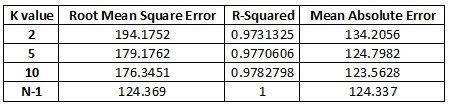
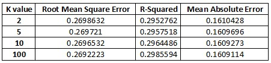

<style>
body {
text-align: justify}
</style>


```{r warning=FALSE,echo=FALSE,message=FALSE}
library(tidyverse)
library(tidymodels)
library(ggplot2)
library(GGally)
library(dplyr)
library(psych)
library(Hmisc)
library(memisc)
library(pastecs)
library(rstatix)
library(bivariate)
library(ggtext)
library(scorecardModelUtils)
library(scatterplot3d)
library(knitr)
library(readxl)
library(ggdark)
library(kableExtra)
library(gridExtra)
library(MASS)
library(bitops)
library(RCurl)
library(ggcorrplot)
library(corrplot)
library(datarium)
library(caret)
library(car)
library(pROC)
library(boot)
set.seed(1234)
options(dplyr.print_min = 10, dplyr.print_max = 6)
```


# Regression Model

A professor of machine learning is planning to get married to his long-time girlfriend. He has never shopped for diamonds before. In the mall, he was confronted with a dizzying array of diamond characteristics, configurations, and pricing. His quick search revealed that diamonds are primarily characterized by 4C viz. Color, Cut, Carat Weight and Clarity besides Polish, Symmetry, and certification. He scrapped the web to collect information from three different wholesaler websites to build his pricing model to ensure he does not get cheated while purchasing the diamond ring. This blog builds a Linear Regression Model to predict the price of the diamond ring of his interest.

```{r out.width="98%", echo=FALSE}
knitr::include_graphics("interest.jpg")
```

## Import Dataset : Diamond data

```{r warning=FALSE,echo=FALSE,message=FALSE}

pp <- read_excel("MBA6636_SM21_Professor_Proposes_Data.xlsx", na = c("n/a", "", "NA"))
test=read.csv("bank.csv",sep = ";" ) 
train=read.csv("bank-full.csv", sep = ";") 
```

## Summary Statistics

The summary of the dataset is shown below. The summary of metric data has the values such as minimum, first quartile, median, mean, third quartile and maximum. However, the summary of non-metric data has the summary of length, class and mode.

```{r warning=FALSE,echo=FALSE,message=FALSE}
summary(pp)
```
## Repeated K-fold cross-validation Resampling with various K values (folds)

```{r warning=FALSE,echo=FALSE,message=FALSE}
# With K = 2
set.seed(125)
train_control_1_k_2 <- trainControl(method = "repeatedcv",number = 2, repeats = 3)
model_1_k_2 <- train(Price ~., data = pp, method = "lm", trControl = train_control_1_k_2)
print(model_1_k_2)
```

```{r warning=FALSE,echo=FALSE,message=FALSE}
# With K = 5
set.seed(125)
train_control_1_k_5 <- trainControl(method = "repeatedcv",number = 5, repeats = 3)
model_1_k_5 <- train(Price ~., data = pp, method = "lm", trControl = train_control_1_k_5)
print(model_1_k_5)
```

```{r warning=FALSE,echo=FALSE,message=FALSE}
# With K = 10
set.seed(125)
train_control_1_k_10 <- trainControl(method = "repeatedcv",number = 10, repeats = 3)
model_1_k_10 <- train(Price ~., data = pp, method = "lm", trControl = train_control_1_k_10)
print(model_1_k_10)
```

```{r warning=FALSE,echo=FALSE,message=FALSE}
# With K = N-1
set.seed(125)
train_control_1_k_N_1 <- trainControl(method = "repeatedcv",number = 439, repeats = 3)
model_1_k_N_1 <- train(Price ~., data = pp, method = "lm", trControl = train_control_1_k_N_1)
print(model_1_k_N_1)
```


```{r warning=FALSE,echo=FALSE,message=FALSE}
# With K = 5
set.seed(125)
train_control_1_k_5 <- trainControl(method = "repeatedcv",number = 5, repeats = 3)
model_1_k_5 <- train(Price ~., data = pp, method = "lm", trControl = train_control_1_k_5)
print(model_1_k_5)
```

In this dataset, 440 samples and 8 predictors are present. The comparison of Resampling parameters among different K values is shown below
```{r out.width="98%", echo=FALSE}

```

From this analysis, it is observable that the accuracy of re-sampling increases if the K values are high or N-1. 


## Bootstrapping Resampling

```{r warning=FALSE,echo=FALSE,message=FALSE}
function_1 <- function(data, i){
 d2 <- data[i,] 
 return(cor(d2$Carat, d2$Price))
}
set.seed(1)
bootstrap_correlation <- boot(pp,function_1,R=10000)
bootstrap_correlation
summary(bootstrap_correlation)
cat("\n","The range of bootstrap correlation is ",range(bootstrap_correlation$t))
cat("\n","The mean of bootstrap correlation is ",mean(bootstrap_correlation$t))
cat("\n","The standard deviation of bootstrap correlation is ",sd(bootstrap_correlation$t))
cat("\n","The class of bootstrap correlation is ",class(bootstrap_correlation),"\n","\n")
boot.ci(boot.out=bootstrap_correlation,type=c('norm','basic','perc','bca'))
```

# Classification Model

## Problem Statement:

The data is related with direct marketing campaigns of a Portuguese banking institution, which is rolling out term deposit for its customers. The marketing campaigns were based on phone calls. Often, more than one contact to the same client was required, in order to access if the product (bank term deposit) would be (or not) subscribed. The classification goal is to predict if the client will subscribe a term deposit (variable y).

## Data:

There are two datasets: 

      1) bank-full.csv with all examples, ordered by date (from May 2008 to November 2010).
      
      2) bank.csv with 10% of the examples (4521), randomly selected from bank-full.csv.
      
## Import Datasets : Bank data
```{r warning=FALSE,echo=FALSE,message=FALSE}
test=read.csv("bank.csv",sep = ";" ) 
train=read.csv("bank-full.csv", sep = ";") 
```

## Step 1: Adding NA values in the datasets

```{r warning=FALSE,echo=FALSE,message=FALSE}
apply(train,2,function(x)sum(is.na(x)))
apply(test,2,function(x)sum(is.na(x)))
```
There are no NA values in train and test datasets.

## Step 2:Data Preparation

Combining both train and test datasets prior to data preparation.

```{r warning=FALSE,echo=FALSE,message=FALSE}
test$y=NA
train$data='train'
test$data='test'
all_data=rbind(train,test)
apply(all_data,2,function(x)sum(is.na(x)))

#droping balance column as it is an undocumented column
all_data$balance <- NULL

#glimpse(all_data)
```

## Creating dummy variables by combining similar categories

### Dummy for Job

```{r warning=FALSE,echo=FALSE,message=FALSE}
t=table(all_data$job)
sort(t)
final=round(prop.table(table(all_data$job,all_data$y),1)*100,1)
s=addmargins(final,2) #add margin across Y
sort(s[,1])
all_data=all_data %>% 
  mutate(job_1=as.numeric(job %in% c("self-employed","unknown","technician")), 
         job_2=as.numeric(job %in% c("services","housemaid","entrepreneur")),
         job_3=as.numeric(job %in% c("management","admin")),
         job_4=as.numeric(job=="student"),
         job_5=as.numeric(job=="retired"),
         job_6=as.numeric(job=="unemployed")) %>% 
  select(-job)
```

### Dummy for marital

```{r warning=FALSE,echo=FALSE,message=FALSE}
t=table(all_data$marital)
sort(t)
all_data=all_data %>% 
  mutate(divorced=as.numeric(marital %in% c("divorced")),
         single=as.numeric(marital %in% c("single"))
         ) %>% 
  select(-marital)
```

### Dummy for education

```{r warning=FALSE,echo=FALSE,message=FALSE}
t=table(all_data$education)
sort(t)
all_data=all_data %>% 
  mutate(edu_primary=as.numeric(education %in% c("primary")),
         edu_sec=as.numeric(education %in% c("secondary")),
         edu_tert=as.numeric(education %in% c("tertiary"))
  ) %>% 
  select(-education)
```

### Dummy for default

```{r warning=FALSE,echo=FALSE,message=FALSE}
table(all_data$default)
all_data$default=as.numeric(all_data$default=="yes")
```

### Dummy for housing

```{r warning=FALSE,echo=FALSE,message=FALSE}
table(all_data$housing)
all_data$housing=as.numeric(all_data$housing=="yes")
```

### Dummy for loan

```{r warning=FALSE,echo=FALSE,message=FALSE}
table(all_data$loan)
all_data$loan=as.numeric(all_data$loan=="yes")
```

### Dummy for contact

```{r warning=FALSE,echo=FALSE,message=FALSE}
t=table(all_data$contact)
sort(t)
all_data=all_data %>% 
  mutate(co_cellular=as.numeric(contact %in% c("cellular")),
         co_tel=as.numeric(contact %in% c("telephone"))
  ) %>% 
  select(-contact)
```

### Dummy for month

```{r warning=FALSE,echo=FALSE,message=FALSE}
t=table(all_data$month)

#Percentage Conversion across months.
finalmnth=round(prop.table(table(all_data$month,all_data$y),1)*100,1)
sss=addmargins(finalmnth,2) #adding margin across Y
sort(sss[,1])

#May is considered as base var
all_data=all_data %>% 
  mutate(month_1=as.numeric(month %in% c("aug","jun","nov","jan","jul")), 
         month_2=as.numeric(month %in% c("dec","sep")),
         month_3=as.numeric(month=="mar"),
         month_4=as.numeric(month=="oct"),
         month_5=as.numeric(month=="apr"),
         month_6=as.numeric(month=="feb")) %>% 
select(-month)
```

### Dummy for outcome

```{r warning=FALSE,echo=FALSE,message=FALSE}
t=table(all_data$poutcome)
sort(t)
all_data=all_data %>% 
  mutate(poc_success=as.numeric(poutcome %in% c("success")),
         poc_failure=as.numeric(poutcome %in% c("failure")),
         poc_other=as.numeric(poutcome %in% c("other"))
         )%>% 
           select(-poutcome)
```
### After Data Preparation

```{r warning=FALSE,echo=FALSE,message=FALSE}
table(all_data$y)
table(train$y)
all_data$y=as.numeric(all_data$y=="yes")
table(all_data$y)
#glimpse(all_data)
```

### After Separating test and train

```{r warning=FALSE,echo=FALSE,message=FALSE}
train=all_data %>% 
  filter(data=='train') %>% 
  select(-data) 
glimpse(train)

test=all_data %>% 
  filter(data=='test') %>% 
  select(-data,-y)
glimpse(test)


# Dividing the train dataset in the ratio 75:25

set.seed(5)
s=sample(1:nrow(train),0.75*nrow(train))
train_75=train[s,]
test_25=train[-s,]
```

## Step 3: Model Building

We will use train for logistic regression model building and use train to test the performance of the model thus built. Lets build logistic regression model on train dataset. In this model, we can observe the following parameters, 

i)   Residual standard error: 0.2695 on 45179 degrees of freedom
ii)  Multiple R-squared:  0.2976
iii) Adjusted R-squared:  0.2971 
iv)  F-statistic: 617.5 on 31 and 45179 DF,  
v)   p-value: < 2.2e-16

```{r warning=FALSE,echo=FALSE,message=FALSE}
for_vif=lm(y~.,data=train)
summary(for_vif)
```

### Fine tuning for multi-collinearity

The logistics regression model is fine tuned in this section where the model has the following parameters.

i)  Null deviance: 32631  on 45210  degrees of freedom
ii) Residual deviance: 21860  on 45180  degrees of freedom

```{r warning=FALSE,echo=FALSE,message=FALSE}
# Removing variables whose  variance inflation factor >5
t=vif(for_vif)
sort(t,decreasing = T)[1:5]

# Removing edu_sec

for_vif=lm(y~.-edu_sec,data=train)
t=vif(for_vif)
sort(t,decreasing = T)[1:5]

fit_train=train %>% 
  select(-edu_sec)

fit=glm(y~.,family = "binomial",data=fit_train) 
summary(fit)

```


### Building final logistic model on significant variables


The final logistic model is built with the predictors such as housing, loan, duration, campaign, previous, job_2, job_4, job_5, divorced, single, edu_primary, edu_tert, co_cellular, co_tel, month_2, month_3, month_4, month_5, month_6, poc_success, poc_failure and poc_other.

```{r warning=FALSE,echo=FALSE,message=FALSE}
fit_final=glm(y~housing+loan+duration+campaign+previous+job_2+job_4+job_5+divorced+single+edu_primary+edu_tert+co_cellular+co_tel+month_2+month_3+month_4+month_5+month_6+poc_success+poc_failure+poc_other,data=fit_train,family="binomial")
summary(fit_final)
names(fit_final$coefficients)
```

## Repeated K-fold cross-validation Resampling with various k values (folds)

We will resample the logistic regression model using Repeated K-fold cross-validation.


```{r warning=FALSE,echo=FALSE,message=FALSE}
# With K = 2
set.seed(125)
train_control_2_k_2 <- trainControl(method = "repeatedcv",number = 2, repeats = 3)
model_2_k_2 <- train(y ~., data = train, method = "lm", trControl = train_control_2_k_2)
print(model_2_k_2)
```

```{r warning=FALSE,echo=FALSE,message=FALSE}
# With K = 5
set.seed(125)
train_control_2_k_5 <- trainControl(method = "repeatedcv",number = 5, repeats = 3)
model_2_k_5 <- train(y ~., data = train, method = "lm", trControl = train_control_2_k_5)
print(model_2_k_5)
```

```{r warning=FALSE,echo=FALSE,message=FALSE}
# With K = 10
set.seed(125)
train_control_2_k_10 <- trainControl(method = "repeatedcv",number = 10, repeats = 3)
model_2_k_10 <- train(y ~., data = train, method = "lm", trControl = train_control_2_k_10)
print(model_2_k_10)
```

```{r warning=FALSE,echo=FALSE,message=FALSE}
# With K = N-1
set.seed(125)
train_control_2_k_N_1 <- trainControl(method = "repeatedcv",number = 100, repeats = 3)
model_2_k_N_1 <- train(y ~., data = train, method = "lm", trControl = train_control_2_k_N_1)
print(model_2_k_N_1)
```


In this dataset, 45211  samples and 31 predictors are present. The comparison of Resampling parameters among different K values is shown below


```{r out.width="98%", echo=FALSE}

```

From this analysis, it is observable that the accuracy of resampling increases if the K values are high or N-1. 


## Bootstrapping Resampling

```{r warning=FALSE,echo=FALSE,message=FALSE}
function_2 <- function(data, i){
 d2 <- data[i,] 
 return(cor(d2$age, d2$y))
}
set.seed(1)
bootstrap_correlation_1 <- boot(fit_train,function_2,R=100)
bootstrap_correlation_1
summary(bootstrap_correlation_1)
cat("\n","The range of bootstrap correlation is ",range(bootstrap_correlation_1$t))
cat("\n","The mean of bootstrap correlation is ",mean(bootstrap_correlation_1$t))
cat("\n","The standard deviation of bootstrap correlation is ",sd(bootstrap_correlation_1$t))
cat("\n","The class of bootstrap correlation is ",class(bootstrap_correlation_1),"\n","\n")
boot.ci(boot.out=bootstrap_correlation_1,type=c('norm','basic','perc')) 
```
