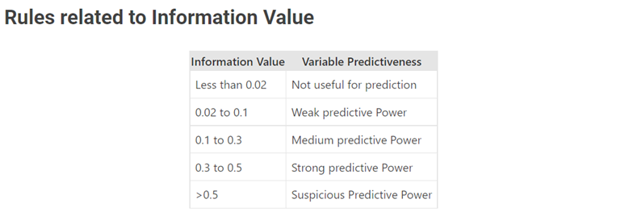
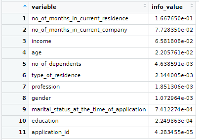
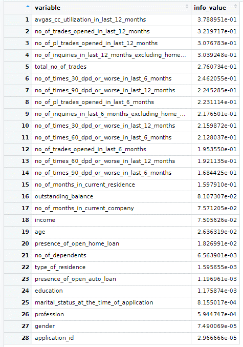
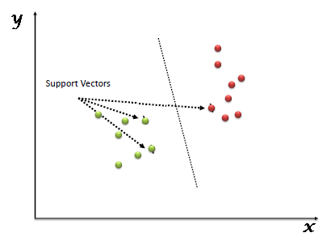
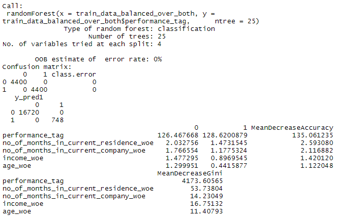
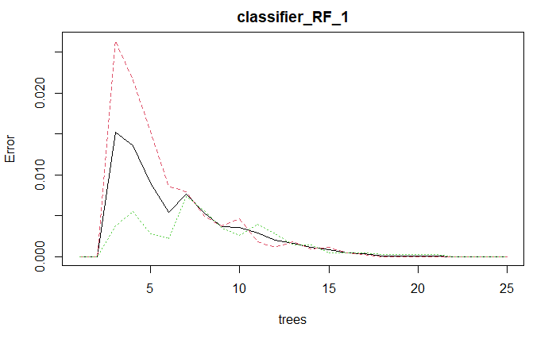
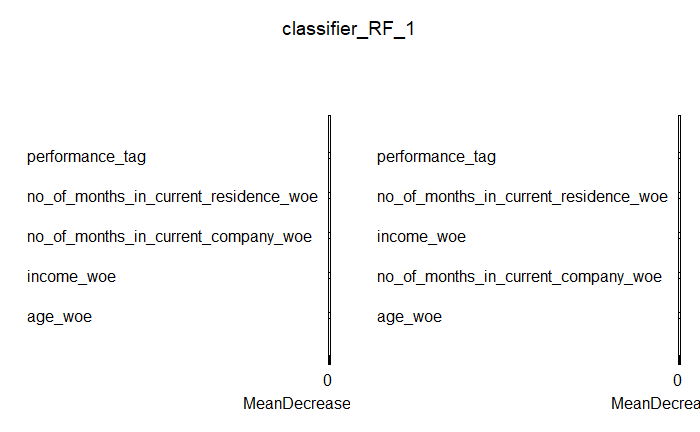

<style>
body {
text-align: justify}
</style>


```{r,warning=FALSE , message=FALSE,echo=FALSE,results=FALSE}
library(DataExplorer)
library(janitor)
library(tidyr)
library(tidyverse)
library(dplyr)
library(yardstick)
library(ggplot2)
library(tidymodels)
library(Information)
library(scorecard)
library(performanceEstimation)
library(car)
library(ROSE)
library(ROCR)
library(caTools)
library(randomForest)
library(e1071)
library(kernlab)
library(MASS)
library(caret)
library(hexbin)
library(rgl)
library(GGally)
library(psych)
library(Hmisc)
library(memisc)
library(pastecs)
library(rstatix)
library(ggtext)
library(scorecardModelUtils)
library(scatterplot3d)
library(knitr)
library(readxl)
library(ggdark)
library(kableExtra)
library(gridExtra)
library(bitops)
library(RCurl)
library(ggcorrplot)
library(corrplot)
library(readr)
library(gmodels)
set.seed(1234)
options(dplyr.print_min = 10, dplyr.print_max = 6)
```

```{r out.width="98%", echo=FALSE}

```

## The Goal

The Goal of this study is to help the credit card provider company CredX to identify the right customer based on predictive model where the past data of the bank's applicants was used to built the predictive model and determine the factors affecting credit risk.

Three models were created which are the Logistic regression, random forest and support vector machine among which the best model is defined as the model with the best accuracy taking inconsideration the sensitivity and specificity.


## The Data

The data provided are two data frames one provide the Demographic data that is obtained from the applicants at the time of the credit card application and the other is Credit Bureau which is taken from the credit bureau.The Demographic data composed of 71295 observations for 11 independent variables and one dependent variable that is the performance_tag while the size of the Credit Bureau is also 71295 observations for 18 independent variables and one dependent variable that is the performance_tag.

During the study we will provide two models the first one is based on the Demographic data only and the second one is based on both the Demographic data and the Credit Bureau data to check the predictive power of the application data. 

## Univariate Analysis

  In the univariate analysis, it is easy notice the frequency of data in the dataset through the graphs. The most frequent values of the dominant predictors are listed as shown below,

i) Age - 38 years
ii) Gender - Male
iii) Marital Status - Married
iv) Number of dependents - 3
v) Income - $
vi) Education - Professional Education
vii) Type of Residence - Rented 
viii) Employement in current company - 60
ix) Profession - SAL
x) Average CC utilisation in last 12 months - 10
xi) Trades opened in last 6 months - 1
xii) Trades opened in last 12 months - 2


## Bivariate Analysis

In the Bivariate Analysis, the correlation plot is easily identified for the demogs data and combined data in the above cluster of plots.

Then the dataset is briefly analysed by the scatter plots between Performance Tag and

i) No of dependents
ii) Income
iii) No of months in current residence
iv) No of months in current residence
v) No of times 90 dpd or worse in last 6 months 
vi) No of times 60 dpd or worse in last 6 months 
vii) No of times 30 dpd or worse in last 6 months 
viii) No of times 90 dpd or worse in last 12 months 
ix) No of times 60 dpd or worse in last 12 months 
x) No of times 30 dpd or worse in last 12 months
xi) Average CC utilisation in last 12 months
xii) Average CC utilisation in last 6 months 
xiii) No of Trades opened in last 12 months
xiv) No of Trades opened in last 6 months
xv) No of PL Trades opened in last 12 months
xvi) No of PL Trades opened in last 6 months
xvii) Presence of Open Home loan
xviii) Outstanding Balance
xix) Total No of trades
xx) Presence of Open Auto loan

```{r warning=FALSE,echo=FALSE,message=FALSE}
                                     ### Reading the demogs.csv File 
demogs_data<-read_csv("demogs.csv")%>%
# Cleaning the names of the columns
clean_names() %>%
# removing the rows where the values of performance_tag are  Nas
drop_na(performance_tag)
#str(demogs_data)

cat("Univariate analysis of demogs data")

#describe(demogs_data)
#stat.desc(demogs_data)
#hist.data.frame(demogs_data)
#summary(demogs_data$age)
#summary(demogs_data$no_of_dependents)
#summary(demogs_data$income)
#summary(demogs_data$no_of_months_in_current_residence)
#summary(demogs_data$no_of_months_in_current_company)

### Performance tag is equally spread over number of dependents 0 and variate Analysis

cat("Distribution of age shows that most of the people are among the range of 37-53. There is two outlier outcome less than 0 which are not acceptable for age variable.")
ggplot(demogs_data, aes(x=age)) + geom_histogram(binwidth = 5, color = "black",fill = "lightgreen") + labs(x = 'Age') + ggtitle("Distribution of Age")+  theme_minimal() + theme(plot.title = element_text(hjust = 0.5))
ggplot(demogs_data, aes(x=age)) + geom_boxplot() + ggtitle("Distribution of Age")

cat("Distribution of gender represents that almost 76 percent of the clients are male.")
ggplot(demogs_data, aes(x=gender)) + geom_bar(binwidth = 70, color = "black",fill = "lightgreen") + labs(x = 'Gender') + ggtitle("Distribution of Gender")+  theme_minimal() + theme(plot.title = element_text(hjust = 0.5))

cat("Distribution of marital status at the time of application represents that almost 85 percent of the clients are married.")
ggplot(demogs_data, aes(x=marital_status_at_the_time_of_application)) + geom_bar(binwidth = 70, color = "black",fill = "lightgreen") + labs(x = 'Gender') + ggtitle("Distribution of marital status at the time of application")+  theme_minimal() + theme(plot.title = element_text(hjust = 0.5))

cat("Distribution of education data shows that professionals, masters, and bachelors indicate the most three type of educated clients, 35, 33, and 25 percent respectively.")
ggplot(demogs_data, aes(x=education)) + geom_bar(binwidth = 70, color = "black",fill = "lightgreen") + labs(x = 'Education') + ggtitle("Distribution of Education")+  theme_minimal() + theme(plot.title = element_text(hjust = 0.5))

cat("Distribution of profession data shows that SAL is the most with number of 39674 of all clients.")
ggplot(demogs_data, aes(x=profession)) + geom_bar(binwidth = 70, color = "black",fill = "lightgreen") + labs(x = 'Profession') + ggtitle("Distribution of Profession")+  theme_minimal() + theme(plot.title = element_text(hjust = 0.5))

cat("Distribution of type of residence data shows that 74% of the clients are renting the house and 20% have their own house.")
ggplot(demogs_data, aes(x=type_of_residence)) + geom_bar(binwidth = 70, color = "black",fill = "lightgreen") + labs(x = 'Type of residence') + ggtitle("Distribution of residence")+  theme_minimal() + theme(plot.title = element_text(hjust = 0.5))

cat("Distribution of number of dependents data shows that half of the observations are have 2, 3, and 4 dependents. Other have 1 or 5 dependents.")
ggplot(demogs_data, aes(x=no_of_dependents)) + geom_histogram(binwidth = 1, color = "black",fill = "lightgreen") + labs(x = 'No of dependents') + ggtitle("Distribution of number of dependents")+  theme_minimal() + theme(plot.title = element_text(hjust = 0.5))
ggplot(demogs_data, aes(x=no_of_dependents)) + geom_boxplot() + ggtitle("Distribution of number of dependents")

cat("Distribution of income data shows that half of the observations have $15-$40 income. The maximum income is $60.The minimum is -0.5 which is an outlier amount and it's not acceptable as income.")
ggplot(demogs_data, aes(x=income)) + geom_histogram(binwidth = 10, color = "black",fill = "lightgreen") + labs(x = 'Income') + ggtitle("Distribution of Income")+  theme_minimal() + theme(plot.title = element_text(hjust = 0.5))
ggplot(demogs_data, aes(x=income)) + geom_boxplot() + ggtitle("Distribution of Income")

cat("Distribution of no of months in current residence represents that most of the observations relates to the 0 month in current residents.")
ggplot(demogs_data, aes(x=no_of_months_in_current_residence)) + geom_histogram(binwidth = 70, color = "black",fill = "lightgreen") + labs(x = 'No of months in current residence', y='Performance Tag') + ggtitle("Distribution of months in current residence")+  theme_minimal() + theme(plot.title = element_text(hjust = 0.5))
ggplot(demogs_data, aes(x=no_of_months_in_current_residence)) + geom_boxplot() + ggtitle("No of months in current residence")

cat("Distribution of no of months in current company represents that most of the clients are new in the company and max number months is 75 month.")
ggplot(demogs_data, aes(x=no_of_months_in_current_company)) + geom_histogram(binwidth = 70, color = "black",fill = "lightgreen") + labs(x = 'No of months in current company') + ggtitle("Distribution of No of months in current company")+  theme_minimal() + theme(plot.title = element_text(hjust = 0.5))
ggplot(demogs_data, aes(x=no_of_months_in_current_company)) + geom_boxplot() + ggtitle("No of months in current company")

cat("Bivariate analysis of demogs data")
cat("According to the results of correlation, there is no significant correlation between performance tag and other variables of the demogs data. The only positive correlation relates to no of months in current residence, 0.02. The negative correlations relates to income and no of months in current company which are, -0.04 and -0.02, respectively. Negative correlation is a relationship between two variables in which one variable increases as the other decreases, and vice versa.")
data(demogs_data)
cat("The Correlation between Number of dependents and performance Tag is",cor(demogs_data$no_of_dependents,demogs_data$performance_tag, use="complete.obs"),"\n")
cat("The Correlation between Number of dependents and performance Tag is",cor(demogs_data$income,demogs_data$performance_tag, use="complete.obs"),"\n")
cat("The Correlation between Number of dependents and performance Tag is",cor(demogs_data$no_of_months_in_current_residence,demogs_data$performance_tag, use="complete.obs"),"\n")
cat("The Correlation between Number of dependents and performance Tag is",cor(demogs_data$no_of_months_in_current_company,demogs_data$performance_tag, use="complete.obs"),"\n")

df <- dplyr::select_if(demogs_data, is.numeric)
r <- cor(df, use="complete.obs")
round(r,2)
ggcorrplot(r)


# Converting the application ID variable to character
demogs_data$ application_id <- as.character(demogs_data$ application_id)
demogs_data$ performance_tag <- as.factor(demogs_data$ performance_tag)
################################################################################################################
                                  ### Reading the Credit_bureau.csv file 
credit_bureau_data<-read_csv("credit_bureau.csv")%>%
# Cleaning the names of the columns
clean_names() %>%
# removing the rows where the values of performance_tag are  Nas
drop_na(performance_tag)
str(credit_bureau_data)

cat("Univariate analysis of credit_bureau data")

#describe(credit_bureau_data)
#stat.desc(credit_bureau_data)
#hist.data.frame(credit_bureau_data)

#summary(credit_bureau_data$outstanding_balance)
#summary(credit_bureau_data$total_no_of_trades)
#summary(credit_bureau_data$avgas_cc_utilization_in_last_12_months)
#summary(credit_bureau_data$no_of_times_90_dpd_or_worse_in_last_6_months)
#summary(credit_bureau_data$no_of_times_90_dpd_or_worse_in_last_12_months)
#summary(credit_bureau_data$no_of_trades_opened_in_last_12_months)
#summary(credit_bureau_data$no_of_pl_trades_opened_in_last_12_months)
#summary(credit_bureau_data$total_no_of_trades)


cat("Distribution of  No of times 90 dpd or worse in last 6_months represents that 78% are 0 and almost 19% are 1.")
ggplot(credit_bureau_data, aes(x= no_of_times_90_dpd_or_worse_in_last_6_months)) + geom_bar(binwidth = 70, color = "black",fill = "lightblue") + labs(x = 'No of times 90 dpd or worse in last 6 months') + ggtitle("Distribution of No of times 90 dpd or worse in last 6_months")+  theme_minimal() + theme(plot.title = element_text(hjust = 0.5))

cat("Distribution of No of times 60 dpd or worse in last 6_months represents that more than 50000 of the clients relates to 0 amount.")
ggplot(credit_bureau_data, aes(x= no_of_times_60_dpd_or_worse_in_last_6_months)) + geom_bar(binwidth = 70, color = "black",fill = "lightblue") + labs(x = 'No of times 60 dpd or worse in last 6 months') + ggtitle("Distribution of No of times 60 dpd or worse in last 6_months")+  theme_minimal() + theme(plot.title = element_text(hjust = 0.5))

cat("Distribution of No of times 30 dpd or worse in last 6 months represents that almost 50000 of the clients relates to 0 amount.")
ggplot(credit_bureau_data, aes(x= no_of_times_30_dpd_or_worse_in_last_6_months)) + geom_bar(binwidth = 70, color = "black",fill = "lightblue") + labs(x = 'No of times 30 dpd or worse in last 6 months') + ggtitle("Distribution of No of times 30 dpd or worse in last 6_months")+  theme_minimal() + theme(plot.title = element_text(hjust = 0.5))

cat("Distribution of No of times 90 dpd or worse in last 12 months represents that almost 50000 of the clients relates to 0 amount.")
ggplot(credit_bureau_data, aes(x= no_of_times_90_dpd_or_worse_in_last_12_months)) + geom_bar(binwidth = 70, color = "black",fill = "lightblue") + labs(x = 'No of times 90 dpd or worse in last 12 months') + ggtitle("Distribution of No of times 90 dpd or worse in last 12_months")+  theme_minimal() + theme(plot.title = element_text(hjust = 0.5))

cat("Distribution of No of times 60 dpd or worse in last 12 months represents that almost 45000 of the clients relates to 0 amount.")
ggplot(credit_bureau_data, aes(x= no_of_times_60_dpd_or_worse_in_last_12_months)) + geom_bar(binwidth = 70, color = "black",fill = "lightblue") + labs(x = 'No of times 60 dpd or worse in last 12 months') + ggtitle("Distribution of No of times 60 dpd or worse in last 12_months")+  theme_minimal() + theme(plot.title = element_text(hjust = 0.5))

cat("Distribution of No of times 30 dpd or worse in last 12 months represents that almost 45000 of the clients relates to 0 amount.")
ggplot(credit_bureau_data, aes(x= no_of_times_30_dpd_or_worse_in_last_12_months)) + geom_bar(binwidth = 70, color = "black",fill = "lightblue") + labs(x = 'No of times 30 dpd or worse in last 12 months') + ggtitle("Distribution of No of times 30 dpd or worse in last 12_months")+  theme_minimal() + theme(plot.title = element_text(hjust = 0.5))

cat("Distribution of Vgas cc_utilization in last 12_months represents that the mean of the data is 29.27.")
ggplot(credit_bureau_data, aes(x= avgas_cc_utilization_in_last_12_months)) + geom_bar(binwidth = 70, color = "black",fill = "lightblue") + labs(x = 'Vgas cc_utilization in last 12_months') + ggtitle("Distribution of Vgas cc_utilization in last 12_months")+  theme_minimal() + theme(plot.title = element_text(hjust = 0.5))

cat("Distribution of no of trades opened in last 6_months represents that 20000 of trades 2 times in last 6 months.")
ggplot(credit_bureau_data, aes(x= no_of_trades_opened_in_last_6_months)) + geom_bar(binwidth = 70, color = "black",fill = "lightblue") + labs(x = 'No of trades opened in last 6_months') + ggtitle("Distribution of No of trades opened in last 6_months")+  theme_minimal() + theme(plot.title = element_text(hjust = 0.5))

cat("Distribution of no of trades opened in last 12_months represents that 11000 of trades 2 times in last 6 month.")
ggplot(credit_bureau_data, aes(x= no_of_trades_opened_in_last_12_months)) + geom_bar(binwidth = 70, color = "black",fill = "lightblue") + labs(x = 'No of trades opened in last 12_months') + ggtitle("Distribution of No of trades opened in last 12_months")+  theme_minimal() + theme(plot.title = element_text(hjust = 0.5))

cat("Distribution of No of pl trades opened in last 6_months represents that 0, 1, and 2 are the three most frequent pl trades in last 6 months.")
ggplot(credit_bureau_data, aes(x= no_of_pl_trades_opened_in_last_6_months)) + geom_bar(binwidth = 70, color = "black",fill = "lightblue") + labs(x = 'No of pl trades opened in last 6_months') + ggtitle("Distribution of No of pl trades opened in last 6_months")+  theme_minimal() + theme(plot.title = element_text(hjust = 0.5))

cat("Distribution of No of pl trades opened in last 12_months represents that 0, 3, and 4 are the three most frequent pl trades in last 6 months.")
ggplot(credit_bureau_data, aes(x= no_of_pl_trades_opened_in_last_12_months)) + geom_bar(binwidth = 70, color = "black",fill = "lightblue") + labs(x = 'No of pl trades opened in last 12_months') + ggtitle("Distribution of No of pl trades opened in last 12_months")+  theme_minimal() + theme(plot.title = element_text(hjust = 0.5))

cat("Distribution of No of inquiries in last 6_months represents that 0, 1, and 2 are the three most frequent pl trades in last 6 months.")
ggplot(credit_bureau_data, aes(x= no_of_inquiries_in_last_6_months_excluding_home_auto_loans)) + geom_bar(binwidth = 1, color = "black",fill = "lightblue") + labs(x = 'No of inquiries in last 6_months excluding home_auto loans') + ggtitle("Distribution of No of inquiries in last 6_months excluding home_auto loans")+  theme_minimal() + theme(plot.title = element_text(hjust = 0.5))

cat("Distribution of no of inquiries in last 12_months excluding home_auto loans represents that 0, 2, 3, and are the four most frequent pl trades in last 6 months.")
ggplot(credit_bureau_data, aes(x= no_of_inquiries_in_last_12_months_excluding_home_auto_loans)) + geom_bar(binwidth = 70, color = "black",fill = "lightblue") + labs(x = 'No of inquiries in last 12_months excluding home_auto loans') + ggtitle("Distribution of No of inquiries in last 12_months excluding home_auto loans")+  theme_minimal() + theme(plot.title = element_text(hjust = 0.5))

cat("Distribution of Presence of open home loan represents that 50000 observations relates to 0 amount and 20000 related to 1.")
ggplot(credit_bureau_data, aes(x= presence_of_open_home_loan)) + geom_bar(binwidth = 70, color = "black",fill = "lightblue") + labs(x = 'Presence of open home loan') + ggtitle("Distribution of Presence of open home loan")+  theme_minimal() + theme(plot.title = element_text(hjust = 0.5))

cat("Distribution of Total no of trades represents that the most amount is 3 with 9000 observations.")
ggplot(credit_bureau_data, aes(x= total_no_of_trades)) + geom_bar(binwidth = 70, color = "black",fill = "lightblue") + labs(x = 'Total no of trades') + ggtitle("Total no of trades")+  theme_minimal() + theme(plot.title = element_text(hjust = 0.5))

cat("Distribution of presence of open auto loan represents that the most amount is 0 with almost 60000 observations.")
ggplot(credit_bureau_data, aes(x= presence_of_open_auto_loan)) + geom_bar(binwidth = 70, color = "black",fill = "lightblue") + labs(x = 'Presence of open auto loan') + ggtitle("Presence of open auto loan")+  theme_minimal() + theme(plot.title = element_text(hjust = 0.5))
```


### Bivariate Analysis of credit_bureau data


```{r warning=FALSE,echo=FALSE,message=FALSE}
data(credit_bureau_data)
```


Among the different variables, the following variables have the most correlation with the performance tag.
no_of_times_30_dpd_or_worse_in_last_6_months: 0.1
no_of_times_30_dpd_or_worse_in_last_12_months: 0.1
no_of_times_60_dpd_or_worse_in_last_6_months: 0.09
no_of_times_60_dpd_or_worse_in_last_12_months: 0.09
avgas_cc_utilization_in_last_12_months: 0.08
no_of_times_90_dpd_or_worse_in_last_6_months: 0.08


```{r warning=FALSE,echo=FALSE,message=FALSE}


cat("The Correlation between no_of_inquiries_in_last_12_months_excluding_home_auto_loans and performance Tag is",cor(credit_bureau_data$no_of_inquiries_in_last_12_months_excluding_home_auto_loans,credit_bureau_data$performance_tag, use="complete.obs"),"\n")
cat("The Correlation between presence_of_open_home_loan and performance Tag is",cor(credit_bureau_data$presence_of_open_home_loan,credit_bureau_data$performance_tag, use="complete.obs"),"\n")
cat("The Correlation between outstanding_balance and performance Tag is",cor(credit_bureau_data$outstanding_balance,credit_bureau_data$performance_tag, use="complete.obs"),"\n")
cat("The Correlation between total_no_of_trades and performance Tag is",cor(credit_bureau_data$total_no_of_trades,credit_bureau_data$performance_tag, use="complete.obs"),"\n")
cat("The Correlation between presence_of_open_auto_loan and performance Tag is",cor(credit_bureau_data$presence_of_open_auto_loan,credit_bureau_data$performance_tag, use="complete.obs"),"\n")
cat("The Correlation between avgas_cc_utilization_in_last_12_months and performance Tag is",cor(credit_bureau_data$avgas_cc_utilization_in_last_12_months,credit_bureau_data$performance_tag, use="complete.obs"),"\n")
cat("The Correlation between no_of_trades_opened_in_last_6_months and performance Tag is",cor(credit_bureau_data$no_of_trades_opened_in_last_6_months,credit_bureau_data$performance_tag, use="complete.obs"),"\n")
cat("The Correlation between no_of_trades_opened_in_last_12_monthss and performance Tag is",cor(credit_bureau_data$no_of_trades_opened_in_last_12_months,credit_bureau_data$performance_tag, use="complete.obs"),"\n")
cat("The Correlation between no_of_pl_trades_opened_in_last_6_months and performance Tag is",cor(credit_bureau_data$no_of_pl_trades_opened_in_last_6_months,credit_bureau_data$performance_tag, use="complete.obs"),"\n")
cat("The Correlation between no_of_pl_trades_opened_in_last_12_months and performance Tag is",cor(credit_bureau_data$no_of_pl_trades_opened_in_last_12_months,credit_bureau_data$performance_tag, use="complete.obs"),"\n")
cat("The Correlation between no_of_inquiries_in_last_6_months_excluding_home_auto_loans and performance Tag is",cor(credit_bureau_data$no_of_inquiries_in_last_6_months_excluding_home_auto_loans,credit_bureau_data$performance_tag, use="complete.obs"),"\n")
cat("The Correlation between no_of_times_90_dpd_or_worse_in_last_6_months and performance Tag is",cor(credit_bureau_data$no_of_times_90_dpd_or_worse_in_last_6_months,credit_bureau_data$performance_tag, use="complete.obs"),"\n")
cat("The Correlation between no_of_times_60_dpd_or_worse_in_last_6_months and performance Tag is",cor(credit_bureau_data$no_of_times_60_dpd_or_worse_in_last_6_months,credit_bureau_data$performance_tag, use="complete.obs"),"\n")
cat("The Correlation between no_of_times_30_dpd_or_worse_in_last_6_months and performance Tag is",cor(credit_bureau_data$no_of_times_30_dpd_or_worse_in_last_6_months,credit_bureau_data$performance_tag, use="complete.obs"),"\n")
cat("The Correlation between no_of_times_90_dpd_or_worse_in_last_12_months and performance Tag is",cor(credit_bureau_data$no_of_times_90_dpd_or_worse_in_last_12_months,credit_bureau_data$performance_tag, use="complete.obs"),"\n")
cat("The Correlation between no_of_times_60_dpd_or_worse_in_last_12_months and performance Tag is",cor(credit_bureau_data$no_of_times_60_dpd_or_worse_in_last_12_months,credit_bureau_data$performance_tag, use="complete.obs"),"\n")
cat("The Correlation between no_of_times_30_dpd_or_worse_in_last_12_months and performance Tag is",cor(credit_bureau_data$no_of_times_30_dpd_or_worse_in_last_12_months,credit_bureau_data$performance_tag, use="complete.obs"),"\n")
df <- dplyr::select_if(credit_bureau_data, is.numeric)
r <- cor(df, use="complete.obs")
round(r,2)
ggcorrplot(r)
# Converting the application ID variable to character
credit_bureau_data$ application_id <- as.character(credit_bureau_data$ application_id)
credit_bureau_data$ performance_tag <- as.factor(credit_bureau_data$ performance_tag)
################################################################################################################
                                  ### Combining both credit bureau and demographic datasets
demog_predictors<- demogs_data%>%
  select(-application_id,-performance_tag)
both_data<-bind_cols(credit_bureau_data,demog_predictors)
```


```{r warning=FALSE,echo=FALSE,message=FALSE}
                                           ## EDA using the DataExplorer Package
#create_report(demogs_data)
#file.rename("report.html", "demogs_report.html")
#create_report(both_data)
#file.rename("report.html", "both_data_report.html")
```

## Splitting the data to training and testing splits

In this step we are going to split the data, so that 3/4 of the data would be assigned for training and the remaining 1/4 of the data would be assigned for testing.

```{r warning=FALSE,echo=FALSE,message=FALSE}
                       ## splitting the Demographic data for training and testing
set.seed(130)
data_split_d <- initial_split(demogs_data,prop = 0.75,strata = performance_tag)
training_data_d<- data_split_d%>%
  training()

testing_data_d <- data_split_d%>%
  testing()
###############################################################################################################
                      ## splitting the combined data for training and testing
set.seed(140)
data_split_both <- initial_split(both_data,prop = 0.75,strata = performance_tag)
training_data_both<- data_split_both%>%
  training()
testing_data_both <- data_split_both%>%
  testing()
```

## Information Vlaue of the predictors

Information value is used to select important predictors in the predictive model, So for the first model that used only the Demographic data we can see that the predictors with high information value (greater than 0.02) are no_of_months_in_current_residence,income, age, no_of_months_in_current_company, and for the second model the predictors with the high information value are all the predictors except application_id,gender_profession, marital_status_at_the_time_of_application, education, presence_of_open_auto_loan, type_of_residence and no_of_dependents.

Based on the table shown below, any predictors whose information value is less than 0.02 is considered not useful and accordingly will be discarded and not used in our predictive models.


```{r out.width="98%", echo=FALSE}

```

From the shown table of the information values of the first model predictors we can see that out of the 11 predictors the first 4 predictors only will be used as their information value is greater than 0.02.


```{r out.width="98%", echo=FALSE}

```

From the shown table of the information values of the second model predictors we can see that out of the 28 predictors the first 20 predictors only will be used as their information value is greater than 0.02.


```{r out.width="98%", echo=FALSE}

```


```{r warning=FALSE,echo=FALSE,message=FALSE,results=FALSE}
                               ### Information Value of the demographic data predictors 
IV_values_d <- iv(dt = training_data_d,y = "performance_tag")
# Selecting the predictors where their IV is >= 0.02
reduced_training_data_d<- training_data_d%>%
  select(no_of_months_in_current_residence,performance_tag, no_of_months_in_current_company,income, age )
reduced_testing_data_d<- testing_data_d%>%
  select(no_of_months_in_current_residence,performance_tag,no_of_months_in_current_company,income, age )
################################################################################################################
                            ### Information Value of the predictors in the combined data  
IV_values_both <- iv(dt = training_data_both,y = "performance_tag")
# Selecting the predictors where their IV is >= 0.02
reduced_training_data_both<- training_data_both%>%
select(-application_id,-gender,-profession,-marital_status_at_the_time_of_application,-education,presence_of_open_auto_loan,-type_of_residence,-no_of_dependents,-presence_of_open_home_loan )
reduced_testing_data_both<- testing_data_both%>%
select(-application_id,-gender,-profession,-marital_status_at_the_time_of_application,-education,presence_of_open_auto_loan,-type_of_residence,-no_of_dependents,-presence_of_open_home_loan )
```


## Creating bins for each predictor 

In this part we will create number of bins for each predictor in the twos models.The bins for each predictor is created based on similarity of dependent variable distribution.


```{r warning=FALSE,echo=FALSE,message=FALSE,results=FALSE}
                   ### Creating Bins for the demographic data 
bins_d <- woebin(dt = reduced_training_data_d,y = "performance_tag")
##############################################################################################################
               ### Creating Bins for the combined data 
bins_both <- woebin(dt = reduced_training_data_both,y = "performance_tag")
```

## Weight of evidence tranformation

In this part we are going to calculate the weight of evidence (WOE) of the continuous predictors that helps to transform a continuous independent variable into a set of bins. Woe tells the predictive power of an independent variable in relation to the dependent variable.

```{r warning=FALSE,echo=FALSE,message=FALSE}
                  ### WOE transformation for the training and testing splits of the  Demographic Data 
woe_demogs_training_data <- woebin_ply(reduced_training_data_d,bins_d)
woe_demogs_testing_data<- woebin_ply(reduced_testing_data_d,bins_d)
###############################################################################################################
                ### WOE transformation for the training and testing splits of the  Combined data
woe_both_training_data<- woebin_ply(reduced_training_data_both,bins_both)
woe_both_testing_data<- woebin_ply(reduced_testing_data_both,bins_both)
```
## Check correct binning with weight of evidence (WOE)

To check that the binning with weight of evidence is correct the binning need to satisfy two criteria:

1.The WOE should be monotonic.
2.The slope resulted from a logistic regression with one independent variable vs the dependent variable must be equal to one or the intercept must be ln(% of non-events / % of events) .

The graphs below show the binning and WOE transformation associated with all the predictors in the two models, From the shown graphs, we can see that the Woe transformation of all the predictors in the two models satisfied the first criteria that all are monotonic.


```{r warning=FALSE,echo=FALSE,message=FALSE}
                  ### checking the correct binning with WOE for all the predictors Part 1 (WOE should be monotonic)
 ### First for the demographic data set
woebin_plot(bins_d$no_of_months_in_current_residence)
woebin_plot(bins_d$no_of_months_in_current_company)
woebin_plot(bins_d$age)
woebin_plot(bins_d$income)
 ##############################################################################################################
 ### second for the combined data set
woebin_plot(bins_both$no_of_times_90_dpd_or_worse_in_last_6_months)
woebin_plot(bins_both$no_of_times_60_dpd_or_worse_in_last_6_months)
woebin_plot(bins_both$no_of_times_30_dpd_or_worse_in_last_6_months)
woebin_plot(bins_both$no_of_times_90_dpd_or_worse_in_last_12_months)
woebin_plot(bins_both$no_of_times_60_dpd_or_worse_in_last_12_months)
woebin_plot(bins_both$no_of_times_30_dpd_or_worse_in_last_12_months)
woebin_plot(bins_both$avgas_cc_utilization_in_last_12_months)
woebin_plot(bins_both$no_of_trades_opened_in_last_6_months)
woebin_plot(bins_both$no_of_trades_opened_in_last_12_months)
woebin_plot(bins_both$no_of_pl_trades_opened_in_last_6_months)
woebin_plot(bins_both$no_of_pl_trades_opened_in_last_12_months)
woebin_plot(bins_both$no_of_inquiries_in_last_6_months_excluding_home_auto_loans )
woebin_plot(bins_both$no_of_inquiries_in_last_12_months_excluding_home_auto_loans)
woebin_plot(bins_both$total_no_of_trades)
woebin_plot(bins_both$no_of_months_in_current_residence)
woebin_plot(bins_both$no_of_months_in_current_company)
woebin_plot(bins_both$income)
woebin_plot(bins_both$age)
woebin_plot(bins_both$outstanding_balance)
```

The logistic regressions resulted from each predictor in the two models Vs the dependent variable show that the slope associated with each regression is one as required.


```{r, warning=FALSE,echo=FALSE,message=FALSE,results=FALSE}
                     ### checking the correct binning with WOE for all the predictors Part 2 (The slop should be 1)
### First for the demographic data set
glm(performance_tag~no_of_months_in_current_residence_woe, data=woe_demogs_training_data,family=binomial)
glm(performance_tag~no_of_months_in_current_residence_woe, data=woe_demogs_training_data,family=binomial)
glm(performance_tag~age_woe, data=woe_demogs_training_data,family=binomial)
glm(performance_tag~income_woe, data=woe_demogs_training_data,family=binomial)
##############################################################################################################
### second for the combined data set
glm(performance_tag~no_of_times_90_dpd_or_worse_in_last_6_months_woe,data=woe_both_training_data,family=binomial)
glm(performance_tag~no_of_times_60_dpd_or_worse_in_last_6_months_woe,data=woe_both_training_data,family=binomial)
glm(performance_tag~no_of_times_30_dpd_or_worse_in_last_6_months_woe,data=woe_both_training_data,family=binomial)
glm(performance_tag~no_of_times_90_dpd_or_worse_in_last_12_months_woe,data=woe_both_training_data,family=binomial)
glm(performance_tag~no_of_times_60_dpd_or_worse_in_last_12_months_woe,data=woe_both_training_data,family=binomial)
glm(performance_tag~no_of_times_30_dpd_or_worse_in_last_12_months_woe,data=woe_both_training_data,family=binomial)
glm(performance_tag~avgas_cc_utilization_in_last_12_months_woe,data=woe_both_training_data,family=binomial)
glm(performance_tag~no_of_trades_opened_in_last_6_months_woe,data=woe_both_training_data,family=binomial)
glm(performance_tag~no_of_trades_opened_in_last_12_months_woe,data=woe_both_training_data,family=binomial)
glm(performance_tag~no_of_pl_trades_opened_in_last_6_months_woe,data=woe_both_training_data,family=binomial)
glm(performance_tag~no_of_pl_trades_opened_in_last_12_months_woe,data=woe_both_training_data,family=binomial)
glm(performance_tag~no_of_inquiries_in_last_6_months_excluding_home_auto_loans_woe,data=woe_both_training_data,family=binomial)
glm(performance_tag~no_of_inquiries_in_last_12_months_excluding_home_auto_loans_woe ,data=woe_both_training_data,family=binomial)
glm(performance_tag~total_no_of_trades_woe,data=woe_both_training_data,family=binomial)
glm(performance_tag~no_of_months_in_current_residence_woe,data=woe_both_training_data,family=binomial)
```

## Data Balance

As an important step before using the data in predictive models is to check the data balance, where the imbalanced data refers to the number of observations in the training dataset for each class is not balanced. If the data is imbalance it would result in poor performance for the predictive models because of the severely skewed class distribution.

The training splits for the both the demographic and combined data are of 52402 observations out of which 50193 observations for 0 performance_tag class  and 2209 observations for 1 performance_tag class.so the percentage of the customers with performance tag equal to one is around 4.2 % in our training data sets for both the Demographic and combined dataframe, which is considered very small portion and resulted in imbalanced data sets.


performance_tag     n


 0               50193
 
 
 1                2209
```{r, warning=FALSE,echo=FALSE,message=FALSE}
                       ## Checking the balance of the data with respect to the performance_tag 
# first the demogs training data data
count_demogs_data_train<- training_data_d%>% count(performance_tag)
bad_percent_demogs_train<-count_demogs_data_train$n[2]*100/(count_demogs_data_train$n[1]+count_demogs_data_train$n[2])
##################################################################################################################################
# Third for the combined training data 
count_both_data_train<- training_data_both%>% count(performance_tag)
bad_percent_both_train<-count_both_data_train$n[2]*100/(count_both_data_train$n[1]+count_both_data_train$n[2])
```

## Balance the imbalanced data

To balance the imbalanced data we need to artificially create 1 performace_tag observations. Smote function is used to handles unbalanced classification problems using the SMOTE method. Namely, it can generate a new "SMOTEd" data set that addresses the class unbalance problem.

The resulted balanced data is as shown:

   0    1 
4418 4418 

   0    1 
4444 4444 

```{r, warning=FALSE,echo=FALSE,message=FALSE,results=FALSE}
                                                  ## Handle the unbalanced data
 set.seed(1000)
train_data_balanced_over <- smote(performance_tag ~ ., woe_demogs_training_data, perc.over = 1,perc.under=2)
table(train_data_balanced_over$performance_tag)
 
 set.seed(2000)
train_data_balanced_over_both <- smote(performance_tag ~ ., woe_both_training_data, perc.over =1 ,perc.under=2)
table(train_data_balanced_over_both$performance_tag)
 
 
 
```

### Logistic Regression Model 


Two logistic regression models are created.First logistic regression predictive model is created that used only the demographic balanced WOE transformed training data split for training the model and the second logistic regression predictive model is created that used combined balanced WOE transformed training data split for training the model.

In the logistic regression models, the P-Value and the VIF value are used for further filtration for the predictors used in each model. Also the receiver operating characteristic curve (ROC) was used to tune the logistic models by determining the most suitable cut off threshold value.


```{r, warning=FALSE,echo=FALSE,message=FALSE,results=FALSE}
                       ## Logistic Regression Model based on the demographic data only
mdl_demogs <- glm(performance_tag ~ ., data = train_data_balanced_over, family = "binomial")
summary(mdl_demogs)
vif(mdl_demogs)
# Predict on the testing data
pred_demogs<- woe_demogs_testing_data %>%
  select(performance_tag)%>%
  mutate(demogs_class=(predict(mdl_demogs, woe_demogs_testing_data,type="response")))
# Roc Curve
demogs_cl=(predict(mdl_demogs, woe_demogs_testing_data,type="response"))
ROCRpred <-prediction(demogs_cl, woe_demogs_testing_data$performance_tag)
# Performance function
ROCRperf = performance(ROCRpred, "tpr", "fpr")
# Plot ROC curve,add colors and threshold labels 
plot(ROCRperf, colorize=TRUE, print.cutoffs.at=seq(0,1,by=0.1), text.adj=c(-0.2,1.7))
# optimizing the model through threshold value
pred_demogs$demogs_class<-ifelse(pred_demogs$demogs_class>=0.487,1,0)
 pred_demogs$demogs_class<- as.factor(pred_demogs$demogs_class)
# Evaluating the model performance on the training data
# Confusion Matrix:
conf_mt_demogs<- conf_mat(pred_demogs,truth = performance_tag,estimate = demogs_class)
autoplot(conf_mt_demogs,type='heatmap')
# Accuracy:
Acc_demogs<- accuracy(pred_demogs,truth = performance_tag,estimate = demogs_class)
# Sensitivity:
sens_demogs<- sens(pred_demogs,truth = performance_tag,estimate = demogs_class)
# specificity:
spec_demogs<-spec(pred_demogs,truth = performance_tag,estimate = demogs_class)
```

*1st model (using only the demographic data) gave the following results on the testing data* 

Accuracy: 0.569
Sensitivity: 0.569
Specificity: 0.569


```{r, warning=FALSE,echo=FALSE,message=FALSE,results=FALSE}

                       ## Logistic Regression Model based on the combined full data 
mdl_both <- glm(performance_tag ~ ., data = train_data_balanced_over_both, family = "binomial")
summary(mdl_both)
vif(mdl_both)
# updating the logistic model with the predictors vif values <= 2
updated1_mdl_both <- glm(performance_tag ~no_of_times_30_dpd_or_worse_in_last_12_months_woe+avgas_cc_utilization_in_last_12_months_woe+no_of_trades_opened_in_last_12_months_woe+no_of_inquiries_in_last_6_months_excluding_home_auto_loans_woe+age_woe+no_of_months_in_current_company_woe+income_woe+no_of_months_in_current_residence_woe , data = train_data_balanced_over_both, family = "binomial")
summary(updated1_mdl_both)
vif(updated1_mdl_both)
updated1_mdl_both$performance_tag<- as.factor(updated1_mdl_both$performance_tag)
# Predict on the testing data
pred_both<- woe_both_testing_data %>%
  select(performance_tag)%>%
  mutate(both_class=(predict(updated1_mdl_both, woe_both_testing_data,type="response")))
# Roc Curve
both_cl=(predict(updated1_mdl_both, woe_both_testing_data,type="response"))
ROCRpred_both <-prediction(both_cl, woe_both_testing_data$performance_tag)
# Performance function
ROCRperf_both = performance(ROCRpred_both, "tpr", "fpr")
# Plot ROC curve,add colors and threshold labels 
 plot(ROCRperf_both, colorize=TRUE, print.cutoffs.at=seq(0,1,by=0.1), text.adj=c(-0.2,1.7))
# optimizing the model through threshold value
pred_both$both_class<-ifelse(pred_both$both_class>=0.53,1,0)
 pred_both$both_class<- as.factor(pred_both$both_class)
# Evaluating the model performance on the training data
# Confusion Matrix:
conf_mt_both<- conf_mat(pred_both,truth = performance_tag,estimate = both_class)
autoplot(conf_mt_both,type='heatmap')
# Accuracy:
Acc_both<- accuracy(pred_both,truth = performance_tag,estimate = both_class)
# Sensitivity:
sens_both<- sens(pred_both,truth = performance_tag,estimate = both_class)
# specificity:
spec_both<-spec(pred_both,truth = performance_tag,estimate = both_class)
```

*2nd model (using the combined data) gave the following results on the testing data*

Accuracy: 0.625
Sensitivity: 0.626
Specificity: 0.606

## Cross validation 

The Cross validation is used for resampling and evaluation of the performance of our logistic regression models, where the 3 metrics used are the accuracy, sensitivity and specificity.

For the 1st logistic regression model running the cross validation with 10 folds gave us an average accuracy of 0.587%, while for the 2nd logistic regression model running the cross validation with 10 folds gave us an average accuracy of 0.631%

```{r, warning=FALSE,echo=FALSE,message=FALSE,results=FALSE}
# Random seed for reproducibility
set.seed(1)
mdl_cv_demogs <- logistic_reg()%>%
set_engine('glm') %>%
set_mode('classification')
# Create 10 folds of the dataset
folds_demogs <- vfold_cv(train_data_balanced_over, v = 10,strata = performance_tag)
# Fit a model for every fold and calculate MAE and RMSE
fits_cv_demogs <- fit_resamples(mdl_cv_demogs,
performance_tag ~ .,
resamples = folds_demogs,
metrics = metric_set(accuracy, spec,sens))
# Collect raw errors of all model runs
all_errors_demogs<- collect_metrics(fits_cv_demogs,summarize = FALSE)
print(all_errors_demogs)
library(ggplot2)
ggplot(all_errors_demogs, aes(x = .estimate,fill = .metric)) +
geom_histogram()
# Collect and summarize errors of all model runs
collect_metrics(fits_cv_demogs)
```

```{r, warning=FALSE,echo=FALSE,message=FALSE,results=FALSE}
# Random seed for reproducibility
set.seed(131)
mdl_cv_both<-logistic_reg()%>%
set_engine('glm') %>%
set_mode('classification')
# Create 10 folds of the dataset
folds_both <- vfold_cv(train_data_balanced_over_both, v = 10,strata = performance_tag)
# Fit a model for every fold and calculate MAE and RMSE
fits_cv_both <- fit_resamples(mdl_cv_both,
performance_tag ~ .,
resamples = folds_both,
metrics = metric_set(accuracy, spec,sens))
# Collect raw errors of all model runs
all_errors_both<- collect_metrics(fits_cv_both,summarize = FALSE)
print(all_errors_both)
library(ggplot2)
ggplot(all_errors_both, aes(x = .estimate,fill = .metric)) +
geom_histogram()
# Collect and summarize errors of all model runs
collect_metrics(fits_cv_both)
```
## Conclusion from the Logistic regression models

* Comparing the first model accuracy of 0.569% to the cross validation accuracy of 0.587% , we can see that our model is well built.

* Comparing the second model accuracy of 0.625% to the cross validation accuracy of 0.631% , we can see that our model is well built.

* Comparing the first model accuracy of 0.569% to the second model accuracy of 0.625% , we can see that the second model is better in prediction than the first model, so that the second model that used the combined data was better than the first model that used only the demographic data.

## Support Vector Machine Model

“Support Vector Machine” (SVM) is a supervised machine learning algorithm that can be used for both classification or regression challenges. However,  it is mostly used in classification problems. In the SVM algorithm, we plot each data item as a point in n-dimensional space (where n is a number of features you have) with the value of each feature being the value of a particular coordinate. Then, we perform classification by finding the hyper-plane that differentiates the two classes very well. Support Vectors are simply the coordinates of individual observation. The SVM classifier is a frontier that best segregates the two classes (hyper-plane/ line).

```{r out.width="98%", echo=FALSE}

```

## Building Support Vector Machine Model using demographics dataset

The support vector Machine model is built for performance tag vs other predictors from the demographic dataset with the balanced training data with the C-classification type and radial kernel.

```{r,warning=FALSE , message=FALSE,echo=FALSE}
classifier1 = svm(formula = performance_tag ~ ., data = train_data_balanced_over,type = 'C-classification', kernal="radial")
classifier1
```
The hyperplane of the previous classifier is used here to predict the performance tag of demographic testing data. 

```{r,warning=FALSE , message=FALSE,echo=FALSE}
prediction1 <- predict(classifier1, woe_demogs_testing_data)
prediction2 <- predict(classifier1, train_data_balanced_over)
```


## Building Support Vector Machine Model using both demographics and credit bureau datasets

The support vector Machine model is built for performance tag vs other predictors from the demographic dataset with the balanced training data with the C-classification type and radial kernel.

```{r,warning=FALSE , message=FALSE,echo=FALSE}
classifier3 = svm(formula = performance_tag ~ ., data = train_data_balanced_over_both,type = 'C-classification', kernal="radial")
classifier3
```

The hyperplane of the previous classifier is used here to predict the performance tag of combined testing data.

```{r,warning=FALSE , message=FALSE,echo=FALSE}
prediction3 <- predict(classifier3, woe_both_testing_data)
prediction4 <- predict(classifier3, train_data_balanced_over_both)
```

### Sensitivity and Specificity check of SVM

```{r,warning=FALSE , message=FALSE,echo=FALSE}
actual_values_1<-woe_demogs_testing_data$performance_tag
actual_values_2<-train_data_balanced_over$performance_tag
actual_values_3<-woe_both_testing_data$performance_tag
actual_values_4<-train_data_balanced_over_both$performance_tag
conf_matrix_1<-table(prediction1,actual_values_1)
conf_matrix_2<-table(prediction2,actual_values_2)
conf_matrix_3<-table(prediction2,actual_values_2)
conf_matrix_4<-table(prediction4,actual_values_4)
cat("The sensitivity of SVM model with test dataset of demographic data is ",
sensitivity(conf_matrix_1),"\n")
cat("The sensitivity of SVM model with train dataset of demographic data is",
sensitivity(conf_matrix_2),"\n")
cat("The sensitivity of SVM model with test dataset of combined demographic and credit bureau data is", sensitivity(conf_matrix_2),"\n")
cat("The sensitivity of SVM model with train dataset of combined demographic and credit bureau data is ", sensitivity(conf_matrix_4),"\n","\n","\n")
cat("The specificity of SVM model with test dataset of demographic data is ",
specificity(conf_matrix_1),"\n")
cat("The specificity of SVM model with train dataset of demographic data is",
specificity(conf_matrix_2),"\n")
cat("The specificity of SVM model with test dataset of combined demographic and credit bureau data is", specificity(conf_matrix_4),"\n")
cat("The specificity of SVM model with train dataset of combined demographic and credit bureau data is ", specificity(conf_matrix_4),"\n","\n","\n")
CrossTable(prediction1,
           woe_both_testing_data$performance_tag,
           prop.c = FALSE,
           prop.r = FALSE,
           prop.t = FALSE,
           prop.chisq = FALSE, 
           dnn=c("Predicted Y","True Y"))
```
### Accuracy Check of SVM
```{r,warning=FALSE , message=FALSE,echo=FALSE}
cat("The accuracy of SVM model with test dataset of demographic data is ",
mean(prediction1 == woe_demogs_testing_data$performance_tag)*100, "%","\n")
cat("The accuracy of SVM model with train dataset of demographic data is",
mean(prediction2 == train_data_balanced_over$performance_tag)*100, "%","\n")
cat("The accuracy of SVM model with test dataset of combined demographic and credit bureau data is", mean(prediction3 == woe_both_testing_data$performance_tag)*100, "%","\n")
cat("The accuracy of SVM model with train dataset of combined demographic and credit bureau data is ", mean(prediction4 == train_data_balanced_over_both$performance_tag)*100, "%","\n")
```


## Random forest for Demographics dataset

Random forest is a flexible, easy to use machine learning algorithm that produces, 
even without hyper-parameter tuning, a great result most of the time. It is also one 
of the most used algorithms, because of its simplicity and diversity (it can be used 
for both classification and regression tasks).

Random forest is a supervised learning algorithm. The "forest" it builds, is an ensemble 
of decision trees, usually trained with the “bagging” method. The general idea of the 
bagging method is that a combination of learning models increases the overall result.

Overall, random forest builds multiple decision trees and merges them together to get a more accurate and stable prediction.
We get %100 accuracy for the random forest model prediction. It seems that random forest can correctly predict all of the observations.

The random forest model trains trees on bootstrap samples. It uses random predictors across trees. It's hyperparameter includes  ntrees = 500.


```{r,warning=FALSE , message=FALSE,echo=FALSE}


set.seed(120) # Setting seed
classifier_RF = randomForest(x = train_data_balanced_over, y = train_data_balanced_over$performance_tag, ntree = 25)
classifier_RF
# Predicting the Test set results
y_pred = predict(classifier_RF, newdata = woe_demogs_testing_data)
  
# Confusion Matrix
confusion_mtx = table(woe_demogs_testing_data$performance_tag, y_pred)
confusion_mtx
  
# Plotting model
plot(classifier_RF)
  
# Importance plot
randomForest::importance(classifier_RF)
  
# Variable importance plot
varImpPlot(classifier_RF)
```


## Random forest for both Demographics and Credit Bureau dataset

```{r,warning=FALSE , message=FALSE,echo=FALSE}



```

```{r eval=FALSE, , message=FALSE, include=FALSE}

set.seed(120) # Setting seed
classifier_RF1 = randomForest(x = train_data_balanced_over_both, y = train_data_balanced_over_both$performance_tag, ntree = 25)
classifier_RF1
# Predicting the Test set results
y_pred1 = predict(classifier_RF1, newdata = woe_both_testing_data)
  
# Confusion Matrix
confusion_mtx_1 = table(woe_both_testing_data$performance_tag, y_pred1)
confusion_mtx_1
  
# Plotting model
plot(classifier_RF_1)
  
# Importance plot
importance(classifier_RF_1)
  
# Variable importance plot
varImpPlot(classifier_RF_1)
```

## Financial Benefit

Among the three discussed models, namely Linear Regression Model, Support Vector Machine Model and Random Forest Model, the best model is selected based on the accuracy. Therefore, the Random Forest model is selected as the best due to its accuracy of 100 %. Furthermore, the financial benefit is calculated based on the predicted defaulters from the dataset using the defined model. This model finds around 748 defaulters from the dataset. For instance, if a defaulter can cause a loss of around $1000, then the total loss sums upto $748,000. So, this model saved the amount of $748,000 which is generally considered as huge financial benefit.


